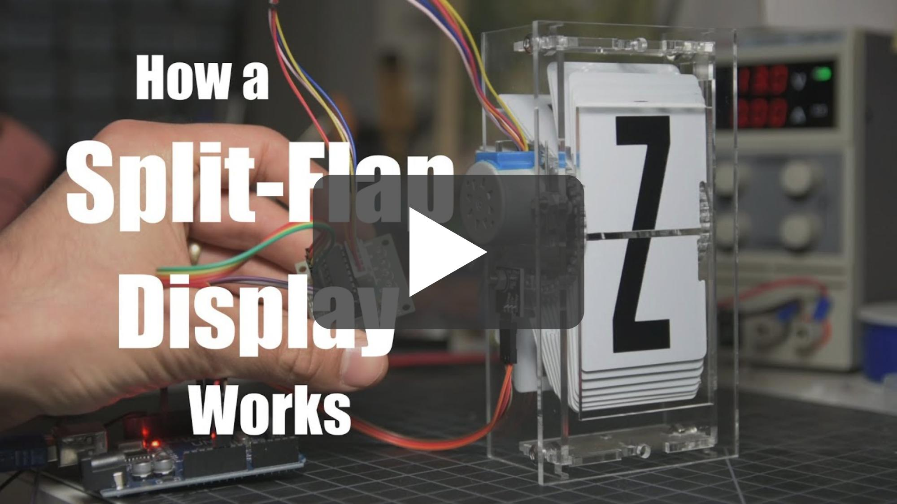

# Split-Flap Display

This is a DIY ESP32-based [split-flap display](https://en.wikipedia.org/wiki/Split-flap_display), optimized for easy assembly at home in small quantities but able to be scaled up to large affordable displays.


[](https://github.com/scottbez1/splitflap/actions/workflows/3d.yml?query=branch%3AfontExploration)
[](https://github.com/scottbez1/splitflap/actions/workflows/electronics.yml?query=branch%3AfontExploration)
[](https://github.com/scottbez1/splitflap/actions/workflows/pio.yml?query=branch%3AfontExploration)

The [splitflap community Discord server](https://discord.com/invite/wgehm3PcrC) is the best place to keep up with the latest changes or ask questions about the project!

Want to help support development or just say "thanks"? Consider a one-time or monthly sponsorship:

| [:heart: Sponsor scottbez1 on GitHub](https://github.com/sponsors/scottbez1) |
|---|

<a href="https://www.youtube.com/watch?v=UAQJJAQSg_g" target="_blank">
  
</a>

**Using this project in a commercial setting or for paid client work?** Go right ahead - it's open source (just make sure to follow the terms of the Apache License)! I would, however, ask that you consider [sponsoring the project](https://github.com/sponsors/scottbez1). I've been developing and maintaining this project in my free time for over 8 years, and I'd love to continue working on it. Sponsorships allow me to pay for prototypes and development tools that make this project possible. Unlike pure software projects, every iteration has real hardware costs; sponsorships allow me to keep iterating and improving the project faster. Thank you!


# Current Status
[You can download the **latest stable releases** of the hardware designs from the official 'releases' page.](https://github.com/scottbez1/splitflap/releases)

Releases have been tested and used to produce working units, but as this is a continuously evolving open-source project, there may always be minor issues and/or incomplete documentation from time to time.

## Stable release info

| Component | Version | Notes |
| --- | --- | --- |
| Enclosure/Mechanics | v0.7 | https://github.com/scottbez1/splitflap/releases/tag/v0.7 |
| Electronics - Sensor | v1.1 | https://github.com/scottbez1/splitflap/releases/tag/releases%2Fsensor%2Fv1.1 |
| Electronics - Chainlink Driver | v1.1 | https://github.com/scottbez1/splitflap/releases/tag/releases%2FchainlinkDriver%2Fv1.1 |
| Electronics - Chainlink Buddy [T-Display] | v1.0 | https://github.com/scottbez1/splitflap/releases/tag/releases%2FchainlinkBuddyTDisplay%2Fv1.0 |
| Firmware | latest | Current firmware is backwards-compatible and not strictly versioned; use the latest from the `master` branch |
| Control Software Examples | latest | Example Typescript and Python code for driving the display is in the [software](software) directory. The Typescript library and examples are more actively developed. |

Here's a video of a large 108-module display powered by 18 Chainlink Driver boards and a Chainlink Base:

[](https://youtu.be/g9EPabcxBsM)

## v2 (coming soon!)
A minor refresh of the mechanical and sensor design is currently in beta, and the stable release is expected in Summer 2024.

The beta designs (seen on this page) have been tested are nearly feature-complete, but documentation is still in progress.


**Here's what to expect in v2:**

- **52 flaps per module** for more character/symbol options
- **New printed flap design ("Epilogue")** with 52 flaps per set (see animation above), including several color-block flaps
- **Updated enclosure** and mechanical parts (laser-cut) to accomodate 52 flaps
  - Motor wires now exit downward for less awkward wiring!
- **New sensor PCB** that's easier to assemble and includes an LED for checking the magnet status
- **Software-configurable calibration** rather than mechanical sensor adjustment

**But many things are staying the same for easy upgrades/compatibility:**
- No change to flap dimensions!
- No changes to Chainlink Driver, Chainlink Buddy boards, or system architecture!
- 40-flap modules are still an officially supported option!
- Open source, as always!
- v0 parts (sensor kits) will continue to be stocked at Bezek Labs through 2024; don't worry if you haven't finished your build yet, the old sensor kits aren't going away!

I'd love to hear your thoughts and questions about this project, and happy to incorporate any feedback you might have into these designs! Please feel free (and encouraged) to [open GitHub issues](https://github.com/scottbez1/splitflap/issues/new), email me directly, reach out [on Twitter](https://twitter.com/scottbez1), and [get involved](https://github.com/scottbez1/splitflap/pulls) in the open source development and let's keep chatting and building together!

# Build Your Own
If you have any questions, please don't hesitate to ask in the [community Discord server](https://discord.gg/Hxnftc8PyW)!

Note: the ordering and assembly guides have not yet been updated for the beta v2 designs. Ask in Discord if you have any questions about ordering or assembling a v2 display!

* [**Ordering guide (the "easy" route) - updated for Chainlink**](https://paper.dropbox.com/doc/Splitflap-Ordering-the-easy-route--BsXzf8VyILR3nl1vUpOi28TWAg-0i6r3aqw6kZVXQOP2MyNr)
* [**Chainlink Driver Electronics User Guide**](https://paper.dropbox.com/doc/Chainlink-Driver-v1.1-Electronics-User-Guide--BsVuP9OHVo952_ZdJDBomCCzAg-U0DAXrSxEoOhgSoRU39hq)
* [**Latest stable release**](https://github.com/scottbez1/splitflap/releases)
* [**Assembly instructions (v0.5/0.6/0.7)**](https://paper.dropbox.com/doc/Splitflap-Kit-v0.5v1.0-Instructions--ASQDu1uoa6n4_t1pva1bM1MgAg-bxXJlke5ROmamcx4OH44r)

# Table of Contents
- [Design Overview](#design-overview)
  - [Mechanical](#mechanical)
  - [Electronics](#electronics)
    - [Sensor PCBs](#sensor-pcbs-1-per-module)
    - [Chainlink Driver](#chainlink-driver-1-per-6-modules)
    - [Chainlink Buddy \[T-Display\]](#chainlink-buddy-t-display-1-for-entire-display)
    - [Advanced items](#advanced-items)
      - [Chainlink Buddy \[Breadboard\]](#chainlink-buddy-breadboard-1-for-entire-display-alternative-to-t-display)
      - [Chainlink Base](#chainlink-base-1-for-entire-display-large-displays)
    - [Older designs](#older-designs)
      - [Classic controller](#classic-controller-electronics-deprecated)
    + [Miscellaneous Tools](#miscellaneous-tools)
      - [Flaps and Fonts](#flaps-and-fonts)
      - [3D Printed Tools](#3d-printed-tools)
      - [Chainlink Driver Tester](#chainlink-driver-tester)
  * [Code](#code)
    + [Firmware](#firmware)
    + [Computer Control Software](#computer-control-software)
- [Contributing/Modifying](#contributingmodifying)
  * [3D Design](#3d-design)
  * [Electronics Design](#electronics-design)

# Design Overview

## Mechanical
The mechanical/structural components are made from laser-cut 3mm MDF or acrylic, and held together with M4 bolts and nuts. The design is parametric and built using OpenSCAD. See below for more info on rendering/modifying the design.

You can view an interactive 3d model of the design [here](https://scottbez1.github.io/splitflap/embed.html?branch=fontExploration).

The beta v2 mechanical design officially supports variants with 52 flaps (perfect for use with the new ["Epilogue" printed flaps](https://www.etsy.com/listing/1685633114/)) and 40 flaps. But you can always modify the design to customize it further.

### Stable v0.7 (40-flap modules)


The v0.7 stable release artifacts can be found at the [v0.7 tagged release](https://github.com/scottbez1/splitflap/releases/tag/v0.7).

### Beta v2 (52-flap module option - recommended)


Module dimensions: 

Latest auto-generated (untested!) artifacts<sup>:warning:</sup>:
* For Ponoko 3mm MDF ([svg](https://s3.amazonaws.com/splitflap-artifacts/fontExploration/3d/3d_laser_vector-52-ponoko-3mm-mdf_1x.svg)) 
* For Ponoko 3mm acrylic ([svg](https://s3.amazonaws.com/splitflap-artifacts/fontExploration/3d/3d_laser_vector-52-ponoko-3mm-acrylic_1x.svg)) 
* For generic material (0.18mm kerf correction) ([svg](https://s3.amazonaws.com/splitflap-artifacts/fontExploration/3d/3d_laser_vector-52.svg))
* For Elecrow 3mm Wood ([zipped pdf](https://s3.amazonaws.com/splitflap-artifacts/fontExploration/3d/3d_laser_vector-52-elecrow-3mm-wood_1x.zip))
* For Elecrow 3mm Acrylic ([zipped pdf](https://s3.amazonaws.com/splitflap-artifacts/fontExploration/3d/3d_laser_vector-52-elecrow-3mm-acrylic_1x.zip))

<sup>:warning:</sup>For tested/stable/recommended artifacts, use the [latest release](https://github.com/scottbez1/splitflap/releases) instead

### Beta v2 (40-flap module option)


Module dimensions: 

Latest auto-generated (untested!) artifacts<sup>:warning:</sup>:
* For Ponoko 3mm MDF ([svg](https://s3.amazonaws.com/splitflap-artifacts/fontExploration/3d/3d_laser_vector-40-ponoko-3mm-mdf_1x.svg)) 
* For Ponoko 3mm acrylic ([svg](https://s3.amazonaws.com/splitflap-artifacts/fontExploration/3d/3d_laser_vector-40-ponoko-3mm-acrylic_1x.svg)) 
* For generic material (0.18mm kerf correction) ([svg](https://s3.amazonaws.com/splitflap-artifacts/fontExploration/3d/3d_laser_vector-52.svg))
* For Elecrow 3mm Wood ([zipped pdf](https://s3.amazonaws.com/splitflap-artifacts/fontExploration/3d/3d_laser_vector-40-elecrow-3mm-wood_1x.zip))
* For Elecrow 3mm Acrylic ([zipped pdf](https://s3.amazonaws.com/splitflap-artifacts/fontExploration/3d/3d_laser_vector-40-elecrow-3mm-acrylic_1x.zip))

<sup>:warning:</sup>For tested/stable/recommended artifacts, use the [latest release](https://github.com/scottbez1/splitflap/releases) instead


## Electronics
> [!NOTE]
> For small displays (up to 3 modules), you can skip the custom controller boards and use off-the-shelf ULN2003A driver
modules plugged into an Arduino Uno. This is [partially documented in the wiki](https://github.com/scottbez1/splitflap/wiki/Electronics#basic-prototyping-alternative-electronics-approach)
> but may require some additional tinkering to get it to work. _Help wanted: if you'd like to help improve these instructions,
> please reach out in the Discord server, thanks!_

The "Chainlink" electronics system is designed to support long chains of driver boards to control medium/large displays (up to 100+ split-flap modules).
It's also designed to be easy and cheap to order pre-assembled or build yourself, especially in higher
quantities, due to its simple BOM and surface-mount components.

To build a display, you'll need 3 different electronics:
* One **Sensor PCB** for every split-flap module
* One **Chainlink Driver** board for every 6 split-flap modules. This is what interfaces with the motors and sensors of each module. Chainlink Driver boards can be chained together to construct a large display.
* An ESP32 microcontroller board. There are a few options:
    * For small/medium displays, one of the **Chainlink Buddy** boards are recommended
        * **Chainlink Buddy [T-Display]**  holds a Lilygo T-Display ESP32 module which includes a built-in LCD and 2 buttons
        * **Chainlink Buddy [Breadboard]** makes it easy to connect a Chainlink Driver to a breadboard for prototyping, though you can also easily connect a Chainlink Driver to a breadboard with a few dupont wires.
    * For large displays, the **Chainlink Base** provides a number of advanced features: central
power management/distribution and fault monitoring, UART and RS-485 connections, configuration switches, and status LEDs.

### Sensor PCBs (1 per module)
Each module needs a hall-effect sensor for start-up calibration and fault monitoring. 

#### Sensors for stable v0.7 hardware
Older sensors for the v0.7 and older laser-cut hardware can be found in the [tagged sensor release](https://github.com/scottbez1/splitflap/releases/tag/releases%2Fsensor%2Fv1.1)

<a href="https://s3.amazonaws.com/splitflap-artifacts/refs/tags/releases/sensor/v1.1/electronics-classic/sensor-panelized-pcb-raster.png">

</a>

#### Sensors for beta v2
These boards are small and the designs are available as single PCBs or as a panel, which can be snapped
apart. The panelization is configurable and is optimized for production at low-cost PCB fabricators like JLCPCB, or PCBWay.

<a href="https://s3.amazonaws.com/splitflap-artifacts/fontExploration/electronics-v2/sensor_smd-front-3d.png">

</a>
<a href="https://s3.amazonaws.com/splitflap-artifacts/fontExploration/electronics-v2/sensor_smd-back-3d.png">


</a><a href="https://s3.amazonaws.com/splitflap-artifacts/fontExploration/electronics-v2/panelized_sensor_smd-front-3d.png">

</a>
<a href="https://s3.amazonaws.com/splitflap-artifacts/fontExploration/electronics-v2/panelized_sensor_smd-back-3d.png">

</a>

<a href="https://s3.amazonaws.com/splitflap-artifacts/fontExploration/electronics-v2/sensor_smd-schematic.pdf">

</a>

Latest auto-generated (untested!) artifacts<sup>:warning:</sup>:

* Schematic [pdf](https://s3.amazonaws.com/splitflap-artifacts/fontExploration/electronics-v2/sensor_smd-schematic.pdf)
* Interactive BOM (for manual assembly) [interactive](https://s3.amazonaws.com/splitflap-artifacts/fontExploration/electronics-v2/sensor_smd-ibom.html)
* Fabrication files (single)
  * NOTE: PCBs must be 0.8mm! (rather than the more typical 1.6mm thickness)
  * PCB gerbers [zip](https://s3.amazonaws.com/splitflap-artifacts/fontExploration/electronics-v2/sensor_smd-jlc/gerbers.zip)
  * PCB BOM (for JLCPCB assembly) [csv](https://s3.amazonaws.com/splitflap-artifacts/fontExploration/electronics-v2/sensor_smd-jlc/bom.csv)
  * PCB CPL (for JLCPCB assembly) [csv](https://s3.amazonaws.com/splitflap-artifacts/fontExploration/electronics-v2/sensor_smd-jlc/pos.csv)
* Fabrication files (panelized)
  * NOTE: PCBs must be 0.8mm! (rather than the more typical 1.6mm thickness)
  * PCB gerbers [zip](https://s3.amazonaws.com/splitflap-artifacts/fontExploration/electronics-v2/sensor_smd-panelized-jlc/gerbers.zip)
  * PCB BOM (for JLCPCB assembly) [csv](https://s3.amazonaws.com/splitflap-artifacts/fontExploration/electronics-v2/sensor_smd-panelized-jlc/bom.csv)
  * PCB CPL (for JLCPCB assembly) [csv](https://s3.amazonaws.com/splitflap-artifacts/fontExploration/electronics-v2/sensor_smd-panelized-jlc/pos.csv)

<sup>:warning:</sup>For tested/stable/recommended artifacts, use the [latest release](https://github.com/scottbez1/splitflap/releases) instead

### Chainlink Driver (1 per 6 modules)
<a href="https://s3.amazonaws.com/splitflap-artifacts/fontExploration/electronics-chainlink/chainlinkDriver-3d.png">

</a>

Key features:
* Controls 6 split-flap modules per board
* Primarily SMD and all components (except the pin headers and motor connectors) are available in JLCPCB's parts library
for easy SMD/THT assembly
* Clock and latch lines are buffered on each board with a 74HC125 to support longer chains
* 2 bits of loopback error checking per board (connecting 2 spare output bits on output shift registers to 2 spare inputs) allows the controller
to validate data integrity up and down the whole chain
* Module order goes from right-to-left since this is intended to be installed and accessed from *behind* the modules

Chainlink Driver boards are [available mostly-assembled in the Bezek Labs store](https://www.etsy.com/listing/1123280069/splitflap-chainlink-driver-v11),
and come with the additional connectors and ribbon cables you'll need. Purchases support continued development of this project.

More information on building and using Chainlink Drivers is available in the [Chainlink Driver User Guide](https://paper.dropbox.com/doc/Chainlink-Driver-v1.1-Electronics-User-Guide--BW2lxdjVkAxva68kYw2doWQEAg-U0DAXrSxEoOhgSoRU39hq).

Or if you'd like to order these directly from a fab, this design is optimized for assembly at JLCPCB, and files are automatically generated
for ordering *assembled* PCBs there. Or if you wish to assemble this board yourself instead of paying for assembly, 
you can view the [interactive BOM/placement tool](https://s3.amazonaws.com/splitflap-artifacts/fontExploration/electronics-chainlink/bom/chainlinkDriver-ibom.html)

Depending on available stock at JLCPCB, you may need to manually modify the BOM file to use alternative components, or regenerate the files
yourself using `export_jlcpcb.py` and specifying one or more `LCSC_ALT_*` field names to use a pre-selected alternative part number. See
the schematic for available pre-selected alternatives (check the symbol's properties/fields).

<a href="https://s3.amazonaws.com/splitflap-artifacts/fontExploration/electronics-chainlink/chainlinkDriver-schematic.pdf">

</a>

<a href="https://s3.amazonaws.com/splitflap-artifacts/fontExploration/electronics-chainlink/chainlinkDriver-pcb-raster.png">

</a>

Latest auto-generated (untested!) artifacts<sup>:warning:</sup>:

* Schematic [pdf](https://s3.amazonaws.com/splitflap-artifacts/fontExploration/electronics-chainlink/chainlinkDriver-schematic.pdf)
* PCB overview [pdf](https://s3.amazonaws.com/splitflap-artifacts/fontExploration/electronics-chainlink/chainlinkDriver-pcb-packet.pdf)
* PCB gerbers [zip](https://s3.amazonaws.com/splitflap-artifacts/fontExploration/electronics-chainlink/chainlinkDriver-jlc/gerbers.zip)
* PCB bom (for JLCPCB assembly) [csv](https://s3.amazonaws.com/splitflap-artifacts/fontExploration/electronics-chainlink/chainlinkDriver-jlc/bom.csv)
* PCB CPL (for JLCPCB assembly) [csv](https://s3.amazonaws.com/splitflap-artifacts/fontExploration/electronics-chainlink/chainlinkDriver-jlc/pos.csv)
* PCB bom (for manual assembly) [interactive](https://s3.amazonaws.com/splitflap-artifacts/fontExploration/electronics-chainlink/bom/chainlinkDriver-ibom.html)

<sup>:warning:</sup>For tested/stable/recommended artifacts, use the [latest release](https://github.com/scottbez1/splitflap/releases) instead

### Chainlink Buddy \[T-Display\] (1 for entire display)
<a href="https://s3.amazonaws.com/splitflap-artifacts/fontExploration/electronics-chainlink-buddy-t-display/chainlinkBuddyTDisplay-3d.png">

</a>

The Chainlink Buddy \[T-Display\] is a convenient way to connect a T-Display ESP32 board (recommended microcontroller) to a chain
of Chainlink Drivers.

Key features:
* TTGO T-Display ESP32 module as the controller, which includes USB-C, color IPS LCD display and buttons
* Extra terminals for every pin of the T-Display allow you to connect any other peripherals to the ESP32 (the connection to the Chainlink Driver requires _only 4_ of the GPIOs)
* Optional barrel jack makes it easy to use a "wall wart" AC adapter/power-supply (since the Chainlink Driver only has screw terminals for power) -- plug in a 12V supply
and then run a wire from the onboard screw terminals to the Chainlink Driver's motor power screw terminals.
* Optional 5V regulator allows for powering the ESP32 without a USB connection, using the 12V motor power supply


Chainlink Buddy \[T-Display\] boards are [available in the Bezek Labs store](https://www.etsy.com/listing/1109357786/splitflap-chainlink-buddy-t-display),
and come with the additional connectors you'll need. Purchases support continued development of this project. 


<a href="https://s3.amazonaws.com/splitflap-artifacts/fontExploration/electronics-chainlink-buddy-t-display/chainlinkBuddyTDisplay-schematic.pdf">

</a>

<a href="https://s3.amazonaws.com/splitflap-artifacts/fontExploration/electronics-chainlink-buddy-t-display/chainlinkBuddyTDisplay-pcb-raster.png">

</a>

Latest auto-generated (untested!) artifacts<sup>:warning:</sup>:

* Schematic [pdf](https://s3.amazonaws.com/splitflap-artifacts/fontExploration/electronics-chainlink-buddy-t-display/chainlinkBuddyTDisplay-schematic.pdf)
* PCB ([gerbers](https://s3.amazonaws.com/splitflap-artifacts/fontExploration/electronics-chainlink-buddy-t-display/chainlinkBuddyTDisplay-jlc/gerbers.zip) / [pdf](https://s3.amazonaws.com/splitflap-artifacts/fontExploration/electronics-chainlink-buddy-t-display/chainlinkBuddyTDisplay-pcb-packet.pdf))
* Panelized PCB ([gerbers](https://s3.amazonaws.com/splitflap-artifacts/fontExploration/electronics-chainlink-buddy-t-display/chainlinkBuddyTDisplay-panelized-jlc/gerbers.zip) / [pdf](https://s3.amazonaws.com/splitflap-artifacts/fontExploration/electronics-chainlink-buddy-t-display/chainlinkBuddyTDisplay-panelized-pcb-packet.pdf))
* PCB bom (for manual assembly) [interactive](https://s3.amazonaws.com/splitflap-artifacts/fontExploration/electronics-chainlink-buddy-t-display/bom/chainlinkBuddyTDisplay-ibom.html)

<sup>:warning:</sup>For tested/stable/recommended artifacts, use the [latest release](https://github.com/scottbez1/splitflap/releases) instead

### Advanced items
#### Chainlink Buddy \[Breadboard\] (1 for entire display; alternative to T-Display)
<a href="https://s3.amazonaws.com/splitflap-artifacts/fontExploration/electronics-chainlink-buddy-breadboard/chainlinkBuddyBreadboard-3d.png">

</a>

The Chainlink Buddy \[Breadboard\] makes it easy to connect a Chainlink Driver to a breadboard for prototyping. You could use 5 dupont wires and have a
messy rats nest, or you could use a single ribbon cable and this slick breakout board.

Chainlink Buddy \[Breadboard\] boards are [available in the Bezek Labs store](https://www.etsy.com/listing/1123863267/splitflap-chainlink-buddy-breadboard),
and come with the additional connectors you'll need. Purchases support continued development of this project. 

<a href="https://s3.amazonaws.com/splitflap-artifacts/fontExploration/electronics-chainlink-buddy-breadboard/chainlinkBuddyBreadboard-schematic.pdf">

</a>

<a href="https://s3.amazonaws.com/splitflap-artifacts/fontExploration/electronics-chainlink-buddy-breadboard/chainlinkBuddyBreadboard-pcb-raster.png">

</a>

Latest auto-generated (untested!) artifacts<sup>:warning:</sup>:

* Schematic [pdf](https://s3.amazonaws.com/splitflap-artifacts/fontExploration/electronics-chainlink-buddy-breadboard/chainlinkBuddyBreadboard-schematic.pdf)
* PCB ([gerbers](https://s3.amazonaws.com/splitflap-artifacts/fontExploration/electronics-chainlink-buddy-breadboard/chainlinkBuddyBreadboard-jlc/gerbers.zip) / [pdf](https://s3.amazonaws.com/splitflap-artifacts/fontExploration/electronics-chainlink-buddy-breadboard/chainlinkBuddyBreadboard-pcb-packet.pdf))
* Panelized PCB ([gerbers](https://s3.amazonaws.com/splitflap-artifacts/fontExploration/electronics-chainlink-buddy-breadboard/chainlinkBuddyBreadboard-panelized-jlc/gerbers.zip) / [pdf](https://s3.amazonaws.com/splitflap-artifacts/fontExploration/electronics-chainlink-buddy-breadboard/chainlinkBuddyBreadboard-panelized-pcb-packet.pdf))
* PCB bom (for manual assembly) [interactive](https://s3.amazonaws.com/splitflap-artifacts/fontExploration/electronics-chainlink-buddy-breadboard/bom/chainlinkBuddyBreadboard-ibom.html)

<sup>:warning:</sup>For tested/stable/recommended artifacts, use the [latest release](https://github.com/scottbez1/splitflap/releases) instead

#### Chainlink Base (1 for entire display; large displays)
<a href="https://s3.amazonaws.com/splitflap-artifacts/fontExploration/electronics-chainlink-base/chainlinkBase-3d.png">

</a>

For larger displays, you should take additional care to make the hardware more robust to potential faults. The Chainlink Base is an experimental (but unsupported) controller design that adds some additional functionality. This has been tested and appears to work, but is not recommended for general use.

The Chainlink Base PCB is an optional alternative to a Chainink Buddy, designed for particularly large displays.
It hosts the ESP32 and adds additional connectivity options (terminals for UART and RS485 serial) and
power distribution (independently-monitored power channels for multiple "zones" of Driver boards).

Key features:
* TTGO T-Display ESP32 module as the controller, which includes USB-C, color IPS LCD display and buttons
* Optional master relay output for 12V PSU control (5V relay, up to ~500mA coil current)
  * Future firmware will power on the 12V PSU after a startup self-test, and power off PSU in case of any faults
* 5 channels of independently monitored 12V switches for powering groups of Chainlink Driver boards (6-10A max per channel)
  * Depending on the motors you use, each channel may be able to power about 6 Chainlink Driver boards which is 36 splitflap modules
  * Each channel includes an automotive fuse holder for additional over-current protection
  * INA219 and shunt resistor provide high fidelity voltage and current monitoring 
  * Firmware will power on each channel after a startup self-test, and power off the channel in case of any faults
  * 3.3V output for powering many Chainlink Driver boards
* Flexible controller input power
  * USB power from the T-Display works by default, though external power is recommended for larger displays
  * Regulated 5V can be connected directly to the screw terminals, or
  * if you are using an always-on 12V PSU without a master relay, you can install a buck module and power the board from 12V using the 7-28V screw terminals

<a href="https://s3.amazonaws.com/splitflap-artifacts/fontExploration/electronics-chainlink-base/chainlinkBase-schematic.pdf">

</a>

<a href="https://s3.amazonaws.com/splitflap-artifacts/fontExploration/electronics-chainlink-base/chainlinkBase-pcb-raster.png">

</a>

Latest auto-generated (untested!) artifacts<sup>:warning:</sup>:

* Schematic [pdf](https://s3.amazonaws.com/splitflap-artifacts/fontExploration/electronics-chainlink-base/chainlinkBase-schematic.pdf)
* PCB overview [pdf](https://s3.amazonaws.com/splitflap-artifacts/fontExploration/electronics-chainlink-base/chainlinkBase-pcb-packet.pdf)
* PCB gerbers [zip](https://s3.amazonaws.com/splitflap-artifacts/fontExploration/electronics-chainlink-base/chainlinkBase-jlc/gerbers.zip)
* PCB bom (for manual assembly) [interactive](https://s3.amazonaws.com/splitflap-artifacts/fontExploration/electronics-chainlink-base/bom/chainlinkBase-ibom.html)

<sup>:warning:</sup>There are currently no stable releases of this board, and none are planned. Some past variants of this board have been used, to some success, but it is not considered an
officially supported design

## Older designs
### Classic Controller Electronics (deprecated)
The Classic driver board is deprecated and unsupported.

The Classic controller board was designed to plug into an Arduino like a shield, and could control 4 stepper motors.
Up to 3 driver boards could be chained together, for up to 12 modules controlled by a single Arduino.

The driver uses 2 MIC5842 low-side shift-register drivers, with built-in transient-suppression diodes, to control the motors, and a 74HC165 shift register to read from 4 hall-effect magnetic home position sensors.
There are optional WS2812B RGB LEDs which can be used to indicate the status of each of the 4 channels.


### Miscellaneous Tools

#### Flaps and Fonts
If you'd like to print your own flaps, or cut custom vinyl letter stickers, the project includes a script to generate vector design files
that is extremely configurable:

* Font for text (this is further customizable in OpenSCAD)
* Character-set - which letters/numbers/symbols/colors are included and in what order
* Bleed - extends rendering past the borders of the flaps to compensate for slight misalignment of printing and cutting operations
* Keepout areas - option to highlight keepout violations for manual review, automatically clip them, or ignore them
* Rendering options:
    * Single-sided - useful for previewing how all letters will look on flaps
    * Front/back - for batch duplex printing, generate separate front-side and back-side files (e.g. sign shop printing on a flat sheet of PVC)
    * Side-by-side - for individual flap printing, each flap's front design is laid out side-by-side with its back design

TODO: finish documenting this and render some example images...

#### 3D Printed Tools
The project also includes a number of optional 3D printed designs to make assembly easier. These include:

* [a flap scoring jig](3d/tools/scoring_jig.scad) for precisely marking the cut point when splitting CR80 cards
* [a flap punch jig](3d/tools/punch_jig.scad) for aligning the punch when making the pin cutouts on either side of a flap
* [a flap container](3d/tools/flap_container.scad) for storing and organizing stacks of completed flaps
* [a sensor PCB holder](3d/tools/pcb_case.scad) for storing and protecting soldered sensor boards

All of these designs are parametric and customizable within OpenSCAD. To print them, open up the relevant file in OpenSCAD and use `File -> Export -> Export as STL` to render the design as an STL file for your slicer.


#### Chainlink Driver Tester
<a href="https://s3.amazonaws.com/splitflap-artifacts/fontExploration/electronics-chainlink-tester/chainlinkDriverTester-3d.png">

</a>

This is not likely to be useful unless you're planning to manufacture dozens to hundreds of Chainlink Driver boards, but the Chainlink Driver Tester is a complete testbed
for Chainlink Driver boards as they come assembled by the PCBA fabricator.

This is currently under very active development.

Key features:
* TTGO T-Display (ESP32) controller, screen, and buttons for controlling tests and reporting results
* Pogo-pins for all connectors on the Chainlink Driver board-under-test (screw terminals, sensor pin headers, and motor connectors)
* 12V switch to supply motor power to the board-under-test, with automotive fuse and INA219 voltage/current monitoring (based on the Chainlink Base channel switch design)
* Separate 3.3V supply for the board-under-test, protected with a polyfuse, should avoid browning out the Tester's MCU in case of 3.3V short-circuits
* Motor and sensor connections are broken out from the pogo-pins for a full closed-loop hardware test
* Screw terminals to chain another Chainlink Driver (not under test) to validate that chained outputs work on the board-under-test
* MCP23017 GPIO expander with 8 GPIO pins exposed via headers for future expansion inputs
* Large cutout allows a barcode scanner or camera to be aimed at the bottom of the board-under-test for tracking serial numbers.
* Buzzer option for audible pass/fail feedback


<a href="https://s3.amazonaws.com/splitflap-artifacts/fontExploration/electronics-chainlink-tester/chainlinkDriverTester-schematic.pdf">

</a>

<a href="https://s3.amazonaws.com/splitflap-artifacts/fontExploration/electronics-chainlink-tester/chainlinkDriverTester-pcb-raster.png">

</a>


Latest auto-generated (untested!) artifacts<sup>:warning:</sup>:

* Schematic [pdf](https://s3.amazonaws.com/splitflap-artifacts/fontExploration/electronics-chainlink-tester/chainlinkDriverTester-schematic.pdf)
* PCB overview [pdf](https://s3.amazonaws.com/splitflap-artifacts/fontExploration/electronics-chainlink-tester/chainlinkDriverTester-pcb-packet.pdf)
* PCB gerbers [zip](https://s3.amazonaws.com/splitflap-artifacts/fontExploration/electronics-chainlink-tester/chainlinkDriverTester-jlc/gerbers.zip)
* PCB bom (for manual assembly) [interactive](https://s3.amazonaws.com/splitflap-artifacts/fontExploration/electronics-chainlink-tester/bom/chainlinkDriverTester-ibom.html)

<sup>:warning:</sup>There are currently no stable releases of this board, and there may never be as it is a niche production tool, not an end product. If you
need this tool, you are likely actively involved in development and should understand the revision history and current status of development enough to make
an informed decision about which revision(s) to use.


## Code
### Firmware
The driver firmware is written using PlatformIO with the Arduino framework and is available at [`arduino/splitflap/Splitflap/Splitflap.ino`](arduino/splitflap/Splitflap/Splitflap.ino). 

The firmware implements a closed-loop controller that accepts letters as input over USB serial and drives the stepper motors using a precomputed acceleration ramp for smooth control. The firmware automatically calibrates the spool position at startup, using the hall-effect magnetic sensor, and will automatically recalibrate itself if it ever detects that the spool position has gotten out of sync. If a commanded rotation is expected to bring the spool past the "home" position, it will confirm that the sensor is triggered neither too early nor too late; otherwise it will search for the "home" position to get in sync before continuing to the desired letter.

### Computer Control Software
The display can be controlled by a computer connected to the Arduino over USB serial. A basic python library for interfacing with the Arduino and a demo application that displays random words can be found in the [software](software) directory.

Commands to the display are sent in a basic plain-text format, and messages _from_ the display are single-line JSON objects, always with a `type` entry describing which type of message it is.

When the Arduino starts up, it sends an initialization message that looks like:
```
{"type":"init", "num_modules":4}
```

The display will automatically calibrate all modules, and when complete it will send a status update message:
```
{
    "type":"status",
    "modules":[
        {"state":"normal", "flap":" ", "count_missed_home":0, "count_unexpected_home":0},
        {"state":"sensor_error", "flap":"e", "count_missed_home":0, "count_unexpected_home":0},
        {"state":"sensor_error", "flap":"e", "count_missed_home":0, "count_unexpected_home":0},
        {"state":"sensor_error", "flap":"e", "count_missed_home":0, "count_unexpected_home":0}
    ]
}
```
(Note: this is sent as a single line, but has been reformatted for readability above)

In this case the Arduino was programmed to support 4 modules, but only 1 module is connected, so the other 3 end up in `"sensor_error"` state. More on status updates below.

At this point you can command the display to show some letters. To do this, send a message to the Arduino that looks like this:
```
=hiya\n
```
The `=` indicates a movement command, followed by any number of letters, followed by a newline. You don't have to send the exact number of modules - if you send fewer letters than modules, only the first N modules will be updated and the remainder won't move. For instance, you could send `=a\n` as shorthand to only set the first module (even if there are 12 modules connected). Any letters that can't be displayed are considered a no-op for that module.

Whenever ALL modules come to a stop, the Arduino will send a status update message (just like the one following initialization, shown above). Here's what the fields mean in each module's status entry:
- **state** - `normal` indicates it's working as intended, `sensor_error` indicates the module can't find the home position and has given up trying (it will no longer respond to movement commands until told to recalibrate - see below). `panic` indicates the firmware detected a programming bug and has gone into failsafe mode (it will no longer respond to movement commands and requires a full reset of the Arduino to recover - should never happen).
- **flap** - which letter is shown by this module
- **count\_missed\_home** - number of times the module expected to pass the home position but failed to detect it. If this is non-zero, it indicates either a flaky sensor or that the motor may have jammed up. The module automatically attempts to recalibrate whenever it misses the home position, so if this number is non-zero and the module is still in the `normal` state, it means the module successfully recovered from the issue(s). However, if this number keeps going up over continued use, it may indicate a recurrent transient issue that warrants investigation.
- **count\_unexpected\_home** - number of times the module detected the home position when it wasn't supposed to. This is rare, but would indicate a flaky/broken sensor that is tripping at the wrong time. Just like with missed home errors, unexpected home errors will cause the module to attempt to recalibrate itself.

If you want to make all modules recalibrate their home position, send a single @ symbol (no newline follows):
```
@
```
This recalibrates all modules, including any that were in the `sensor_error` state; if recalibration succeeds they will return to the `normal` state and start responding to movement commands again.


# Contributing/Modifying

Looking to make some modifications or play around with the design on your local machine? Jump right in! Note that all of the scripts and automation are developed for Ubuntu. Mac OS support is planned,
but not currently implemented (but feel free to open a PR if you want to help!).

## 3D Design

The main design file is [`3d/splitflap.scad`](3d/splitflap.scad)

You'll need a recent version of OpenSCAD (e.g. 2015-03), which may need to be installed through the PPA:
`sudo add-apt-repository ppa:openscad/releases`

In general, solid objects such as the enclosure sides or spool components are built from 2d primitives and then extruded to the appropriate thickness for 3d rendering, rather than using 3d primitives. This simplifies the design without losing expressiveness; the perpendicular laser cut beam doesn't allow for cuts that vary in the Z dimension anyway.

Note that while the design is parameterized and many values may be tweaked, there is currently no error checking for invalid parameters or combinations of parameters. Please take care to validate the design if you change any parameters. For instance, while most of the design will adjust to a changed `num_modules` value, certain values may cause some elements to intersect with other elements or protrude beyond their expected dimensions.

### Rendering
#### Laser-cut vector files
The design can be rendered to 2d for laser cutting by running [`3d/scripts/generate_2d.py [--panelize <number>]`](3d/scripts/generate_2d.py), which outputs to `3d/build/laser_parts/combined.svg`. The optional `--panelize` argument allows for rendering a panel of modules in a single SVG, for bulk laser-cutting.

Internally, the design uses a `projection_renderer` module ([`3d/projection_renderer.scad`](3d/projection_renderer.scad)), which takes a list of child elements to render, and depending on the `render_index` renders a single child at a time. It also _adds_ material to each shape to account for the kerf that will be cut away by the laser.

The [`generate_2d.py`](3d/scripts/generate_2d.py) script interacts with the `projection_renderer` module by first using it to determine the number of subcomponents to render, then runs OpenSCAD to export each component to an SVG file. It does some post-processing on the SVG output (notably adds "mm" to the document dimensions), and then combines all components into the single `combined.svg` output.

Once the `combined.svg` file is generated, you'll want to double-check there aren't any redundant cut lines that are shared by multiple adjacent pieces, to save time/cost when cutting. They should be detected automatically (and highlighted in red in the rendering above), but it doesn't hurt to double-check. In Inkscape, select the "Edit paths by nodes" tool and select an edge to delete - the endpoints should turn blue. Then click "Delete segment between two non-endpoint nodes", and repeat this for all other redundant cut lines.

#### Animated gif
The design can be rendered to a rotating 3d animated gif (seen above) by running [`3d/scripts/generate_gif.py`](3d/scripts/generate_gif.py), which outputs to `3d/build/animation/animation.gif`

The `generate_gif.py` script runs multiple OpenSCAD instances in parallel to render the design from 360 degrees to individual png frames, which are then combined into the final gif animation. As part of building the animation, `generate_gif.py` renders the design with multiple configurations (opaque enclosure, see-through enclosure, no-enclosure and no flaps) by setting the `render_enclosure` and `render_flaps` variables.

#### STL models/web viewer
The design can be rendered to a series of STL files (one per color used in the model) in order to be displayed in an [interactive web-based 3d viewer](https://scottbez1.github.io/splitflap/). Similar to the `projection_renderer` used to render individual components for laser-cutting, the [ColoredStlExporter](3d/scripts/colored_stl_exporter.py) detects all the colors used in the model and renders them one-by-one to separate STL files, along with a manifest that maps each STL file to its RGB color. The STL files and manifest are loaded using three.js to display an interactive model on a web site using WebGL. See this blog post for more details on how the export and three.js renderer work: [OpenSCAD Rendering Tricks, Part 3: Web viewer](http://scottbezek.blogspot.com/2016/08/openscad-rendering-tricks-part-3-web.html).


## Electronics Design
All of the electronics are developed using KiCad 5. Panelization is provided by [KiKit](https://github.com/yaqwsx/KiKit) and gerber/BOM generation is provided by [KiBot](https://github.com/INTI-CMNB/KiBot).

### Rendering
The mechanical and electrical design renderings and links above are automatically updated on every commit with the latest rendering. See this blog post for more details on how that works: [Automated KiCad, OpenSCAD rendering using Travis CI](http://scottbezek.blogspot.com/2016/04/automated-kicad-openscad-rendering.html).

The PCB layout can be rendered to an svg or png (seen above) by running [`electronics/scripts/generate_svg.py file.kicad_pcb`](electronics/scripts/generate_svg.py).
This uses KiCad's [Python scripting API](https://docs.kicad-pcb.org/doxygen/md_Documentation_development_pcbnew-plugins.html)
to render several layers to individual svg files, manipulates them to apply color and opacity settings, and then merges them to a single svg.
For additional details, see this blog post: [Scripting KiCad Pcbnew exports](http://scottbezek.blogspot.com/2016/04/scripting-kicad-pcbnew-exports.html).

For reviewing the design, a pdf packet with copper, silkscreen, and drill info can be produced by running [`electronics/scripts/generate_pdf.py file.kicad_pcb`](electronics/scripts/generate_pdf.py).

Gerber files for fabrication can be exported by running [`electronics/scripts/generate_gerber.py file.kicad_pcb`](electronics/scripts/generate_gerber.py).
This generates gerber files and an Excellon drill file with Seeed Studio's [naming conventions](http://support.seeedstudio.com/knowledgebase/articles/1176532-how-to-generate-the-gerber-manufacturing-files) and produces a `.zip` which can be sent for fabrication.

EESchema isn't easily scriptable, so to export the schematic [`electronics/scripts/export_schematic.py`](electronics/scripts/export_schematic.py) starts an X Virtual Frame Buffer (Xvfb) and open the `eeschema` GUI within that virtual display, and then send a series of hardcoded key presses via `xdotool` to interact with the GUI and click through the dialogs. This is very fragile but seems to work ok for now. For additional details, see this blog post: [Using UI automation to export KiCad schematics](http://scottbezek.blogspot.com/2016/04/automated-kicad-schematic-export.html).


# License
I'd love to hear your thoughts and questions about this project, and happy to incorporate any feedback you might have into these designs! Please feel free (and encouraged) to [open GitHub issues](https://github.com/scottbez1/splitflap/issues/new), email me directly, reach out [on Twitter](https://twitter.com/scottbez1), and [get involved](https://github.com/scottbez1/splitflap/pulls) in the open source development and let's keep chatting and building together!

This project is licensed under Apache v2 (see [LICENSE.txt](LICENSE.txt)).

    Copyright 2015-2021 Scott Bezek and the splitflap contributors
    
    Licensed under the Apache License, Version 2.0 (the "License");
    you may not use this file except in compliance with the License.
    You may obtain a copy of the License at
    
        http://www.apache.org/licenses/LICENSE-2.0
    
    Unless required by applicable law or agreed to in writing, software
    distributed under the License is distributed on an "AS IS" BASIS,
    WITHOUT WARRANTIES OR CONDITIONS OF ANY KIND, either express or implied.
    See the License for the specific language governing permissions and
    limitations under the License.
