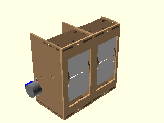

# DIY Split-Flap Display

This is a work in progress DIY [split-flap display](https://en.wikipedia.org/wiki/Split-flap_display).

The goal is to make a low-cost display that's easy to fabricate at home (e.g. custom materials can be ordered from Ponoko or similar, and other hardware is generally available).

The 3d model is built using OpenSCAD in `splitflap.scad`

### Design Highlights ###
* laser cut enclosure and mechanisms from a single material
* cheap, widely available 28byj-48 stepper motor (less expensive than NEMA-17 motors, and doesn't require an expensive high current stepper driver)
* CR80 PVC cards for flaps, cheap in bulk (still need to figure out fabrication of these, or switch to laser-cut plastic...)
* vinyl stickers for flap letters?

### Cost Breakdown ###
* $5 -- MDF 3.2mm P2 [on Ponoko](http://www.ponoko.com/make-and-sell/show-material/64-mdf-natural)
* $21 -- laser cutting on Ponoko
* $7 -- shipping
* ? -- m3,m4 bolts,nuts
* ~$2 -- 28byj-48 motor
* $6.39/2 units -- vinyl letter stickers (minimum letter duplication per pack is 2) [on Amazon](http://www.amazon.com/Duro-Decal-Permanent-Adhesive-Letters/dp/B0027601CM)
* $12/5 units or $36/25 units -- CR80 cards (each CR80 card becomes 2 flaps, each unit requires 40 flaps) on [Amazon](http://www.amazon.com/Plastic-printers-DataCard-Evolis-Magicard/dp/B007M413BC) or [Amazon](http://www.amazon.com/Plastic-printers-DataCard-Evolis-Magicard/dp/B007M413BC or http://www.amazon.com/White-Blank-CR80-020-Graphic-Quality/dp/B007PKD6MW)
* $1.05 -- QRE1113 reflectance sensor [on digikey](http://www.digikey.com/product-detail/en/QRE1113GR/QRE1113GRCT-ND/965713)
* $14/10 units -- PCB for reflectance sensor [on seeedstudio](http://www.seeedstudio.com/service/index.php?r=pcb)

## Getting Started ##

### 3D Design ###
The main design file is `splitflap.scad`

You'll need a recent version of OpenSCAD (at least 2015-03), which needs to be installed through the PPA:
`sudo add-apt-repository ppa:openscad/releases`

### Rendering ###
#### Laser-cutter vector files ####
The design can be rendered to 2d for laser cutting by running `generate_2d.py`, which outputs to `build/laser_parts/combined.svg`

Internally, the design uses a `projection_renderer` module (`projection_renderer.scad`), which takes a list of child elements to render, and depending on the `render_index` renders a single child at a time. It also _adds_ material to each shape to account for the kerf that will be cut away by the laser.

The `generate_2d.py` script interacts with the `projection_renderer` module by first using it to determine the number of subcomponents to render, then runs OpenSCAD to export each component to an SVG file. It does some post-processing on the SVG output (notably adds "mm" to the document dimensions), and then combines all components into the single `combined.svg` output.

#### Animated gif ####
The design can be rendered to a rotating 3d animated gif (seen above) by running `generate_gif.py`, which outputs to `build/animation/animation.gif`

The `generate_gif.py` script runs multiple OpenSCAD instances in parallel to render the design from 360 degrees to individual png frames, which are then combined into the final gif animation. As part of building the animation, `generate_gif.py` renders the design with multiple configurations (opaque enclosure, see-through enclosure, no-enclosure and no flaps) by setting the `render_enclosure` and `render_flaps` variables.

### TODO ###
* Enclosure
    * mounting holes?
    * interlocking mechanism?
    * etched timestamp/commit hash?
* Fabrication
    * 2d projection and panelizing for laser cutter
* Driver
    * need some kind of home-position sensor
        * IR Reflectance sensor near spool? QRE1113?

