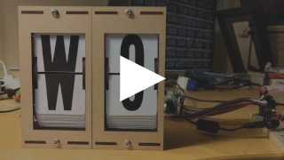

# DIY Split-Flap Display

This is a work in progress DIY [split-flap display](https://en.wikipedia.org/wiki/Split-flap_display).
Prototype four-character display: [video](https://www.youtube.com/watch?v=vq4o_88kN8g).


[](https://www.youtube.com/watch?v=vq4o_88kN8g)

[](https://github.com/scottbez1/splitflap/actions/workflows/3d.yml)
[](https://github.com/scottbez1/splitflap/actions/workflows/electronics.yml)

The goal is to make a low-cost display that's easy to fabricate at home in small/single quantities (e.g. custom materials can be ordered from Ponoko or similar, and other hardware is generally available).

The 3d model is built using OpenSCAD in [`3d/splitflap.scad`](3d/splitflap.scad), the driver board is designed in KiCad in [`electronics/splitflap.pro`](electronics/splitflap.pro), and the driver firmware is written using Arduino (with PlatformIO support) in [`arduino/splitflap/Splitflap/Splitflap.ino`](arduino/splitflap/Splitflap/Splitflap.ino).

You can view an interactive 3d model of the design on the [project website](https://scottbez1.github.io/splitflap/).

**New:** Join the [community Slack group](https://join.slack.com/t/splitflap/shared_invite/zt-dpvol87b-3zUaxXrUd8WauPXr1uBj5Q) to discuss or ask questions about the project!

Want to help support prototyping and development?
<a href="https://www.buymeacoffee.com/scottbez1" target="_blank"></a>

<a href="https://www.youtube.com/watch?v=UAQJJAQSg_g" target="_blank"></a>


### Current Status
[You can download the **latest stable release** from the official 'releases' page.](https://github.com/scottbez1/splitflap/releases/latest)

Releases have been tested and used to produce working units, but as this is a DIY project, there may always be minor issues and/or incomplete documentation.

| Component | Status | Notes |
| --- | --- | --- |
| Enclosure/Mechanics | *Stable* | |
| Classic Controller Electronics | *Stable* | |
| New Chainlink Electronics | *Alpha* | Next-generation/alternative electronics, designed for easier assembly and larger displays |
| Firmware | *Stable* | |
| Control Software Example | *Stable* | Example python code for driving the display is in the [software](software) directory|


I'd love to hear your thoughts and questions about this project, and happy to incorporate any feedback you might have into these designs! Please feel free (and encouraged) to [open GitHub issues](https://github.com/scottbez1/splitflap/issues/new), email me directly, reach out [on Twitter](https://twitter.com/scottbez1), and [get involved](https://github.com/scottbez1/splitflap/pulls) in the open source development and let's keep chatting and building together!

#### :warning: Latest Experimental Files:

**Important:** the files linked below are EXPERIMENTAL and have been auto-generated from the latest commit. They may contain changes that are untested or outright broken. Do not use these unless you are actively making changes to the project and know what you're doing. Otherwise, use the [latest stable release](https://github.com/scottbez1/splitflap/releases/latest).

* Lasercut Vector File
    * For Ponoko 3mm MDF ([svg](https://s3.amazonaws.com/splitflap-artifacts/master/3d/3d_laser_vector-ponoko-3mm-mdf.svg))
    * For Ponoko 3mm acrylic ([svg](https://s3.amazonaws.com/splitflap-artifacts/master/3d/3d_laser_vector-ponoko-3mm-acrylic.svg))
    * For generic material (0.18mm kerf correction) ([svg](https://s3.amazonaws.com/splitflap-artifacts/master/3d/3d_laser_vector.svg))
* Classic Controller electronics
    * Bill of Materials ([csv](https://s3.amazonaws.com/splitflap-artifacts/master/electronics/bom/splitflap-bom.csv), [interactive](https://s3.amazonaws.com/splitflap-artifacts/master/electronics/bom/splitflap-ibom.html))
    * PCB ([gerbers](https://s3.amazonaws.com/splitflap-artifacts/master/electronics/classic-jlc/gerbers.zip) / [pdf](https://s3.amazonaws.com/splitflap-artifacts/master/electronics/classic-pcb-packet.pdf))
    * Panelized PCB ([gerbers](https://s3.amazonaws.com/splitflap-artifacts/master/electronics/classic-panelized-jlc/gerbers.zip) / [pdf](https://s3.amazonaws.com/splitflap-artifacts/master/electronics/classic-panelized-pcb-packet.pdf))
* Sensor PCB, panelized ([gerbers](https://s3.amazonaws.com/splitflap-artifacts/master/electronics/sensor-panelized-jlc/gerbers.zip) / [pdf](https://s3.amazonaws.com/splitflap-artifacts/master/electronics/sensor-panelized-pcb-packet.pdf))
* Chainlink Driver PCB
    * Schematic [pdf](https://s3.amazonaws.com/splitflap-artifacts/master/electronics/chainlinkDriver-schematic.pdf)
    * PCB overview [pdf](https://s3.amazonaws.com/splitflap-artifacts/master/electronics/chainlinkDriver-pcb-packet.pdf)
    * PCB gerbers [zip](https://s3.amazonaws.com/splitflap-artifacts/master/electronics/chainlinkDriver-jlc/gerbers.zip)
    * PCB bom (for JLCPCB assembly) [csv](https://s3.amazonaws.com/splitflap-artifacts/master/electronics/chainlinkDriver-jlc/bom.csv)
    * PCB CPL (for JLCPCB assembly) [csv](https://s3.amazonaws.com/splitflap-artifacts/master/electronics/chainlinkDriver-jlc/pos.csv)
    * PCB bom (for manual assembly) [interactive](https://s3.amazonaws.com/splitflap-artifacts/master/electronics/bom/chainlinkDriver-ibom.html)
* Chainlink Base PCB
    * Schematic [pdf](https://s3.amazonaws.com/splitflap-artifacts/master/electronics/chainlinkBase-schematic.pdf)
    * PCB overview [pdf](https://s3.amazonaws.com/splitflap-artifacts/master/electronics/chainlinkBase-pcb-packet.pdf)
    * PCB gerbers [zip](https://s3.amazonaws.com/splitflap-artifacts/master/electronics/chainlinkBase-jlc/gerbers.zip)
    * PCB bom (for manual assembly) [interactive](https://s3.amazonaws.com/splitflap-artifacts/master/electronics/bom/chainlinkBase-ibom.html)
If you are interested in building a display, I recommend using [one of the stable releases instead](https://github.com/scottbez1/splitflap/releases).

### Design Highlights
* laser cut enclosure and mechanisms from a single material
* cheap, widely available 28byj-48 stepper motor (less expensive than NEMA-17 motors, and doesn't require an expensive high current stepper driver)
* CR80 PVC cards for flaps, cheap in bulk
* store-bought vinyl stickers for flap letters
* control up to 12 modules from a single Arduino Uno


# Build Your Own

* [**Ordering guide (v0.5/0.6/0.7)**](https://paper.dropbox.com/doc/Ordering-Splitflap-v0.5--AS8OCZ~75DLuHBGHhxn94YAMAg-iCwwMo0hRkkAlwdutccWf)
* [**Latest stable release**](https://github.com/scottbez1/splitflap/releases/latest)
* [**Assembly instructions (v0.5/0.6/0.7)**](https://paper.dropbox.com/doc/Splitflap-Kit-v0.5v1.0-Instructions--ASQDu1uoa6n4_t1pva1bM1MgAg-bxXJlke5ROmamcx4OH44r)

## Rough Cost Breakdown

This is an _incomplete_ list of supplies needed to build a split-flap display module to get a rough sense of the overall cost.
Many items have minimum package sizes, so per-unit-prices will be higher when building fewer units due to the need to
buy more items than will actually be used.

Each section includes a subtotal based on building _4 modules_, which is a relatively economical compromise where
shipping costs and MOQs no longer dominate the cost.

Overall, expect to spend somewhere around $200 to $250 for 4 standard 40-character modules.

### Housing ###

The laser-cut housing/mechanics can be ordered from Ponoko (high quality, US-based) or Elecrow. Or you can cut it yourself if
you have a laser-cutter capable of cutting 3mm MDF or acrylic.

#### Ponoko

| Price  | Units per order | Name                               | Supplier | Notes |
|--------|-----------------|------------------------------------|----------|-------|
| $52.97 | 4               | 4x MDF 3 mm, laser-cut, shipping   | Ponoko   |       |
| $14    | N/A             | Setup fee                          | Ponoko   |       |

**Total:** $16.75 per unit (at 4 units)

#### Elecrow
| Price | Units per order | Name                                   | Supplier | Notes |
|-------|-----------------|----------------------------------------|----------|-------|
| $15   | 5               | Wood laser cut, 3 mm, no engraving     | Elecrow  |       |
| $22   | 5               | Shipping                               | Elecrow  |       |

**Total:** $9.25 per unit (at 4 units)

### Hardware & Consumables

| Price | Units per order | Name                                | Supplier     | Notes                     |
|-------|-----------------|-------------------------------------|--------------|---------------------------|
| $5-10 | 4               | 50 pack M4-10 Button-Head Hex Screw | Many options | 11 screws needed per unit |
| $5-10 | 4               | 50 pack M4 Hex Nut                  | Many options | 11 nuts needed per unit   |

**Total:** $2.50-5.00 per unit (at 4 units)

### Flaps

There are two options for flaps: hand-cut or professionally die-cut.

#### Hand-Cut (Option 1)

Each card needs to be cut in half and then have two pieces punched out of either side. Each display unit requires 40 flaps, or 20 cards per unit. 100 cards is enough for 5 units in theory, but 4 in practice because there are no spares for mistakes.

| Price | Units per order | Name                   | Supplier | Notes                            |
|-------|-----------------|------------------------|----------|----------------------------------|
| $14   | 4               | Blank white CR80 cards | Amazon   | One package ($14) covers 4 units |
| $9.17 | N/A             | Badge slot punch tool  | Amazon   | One-time, up front cost          |
| $7    | 2               | Vinyl letter stickers  | Amazon   | One package ($7) covers 2 units  |

**Total:** $7.00 per unit (at 4 units) + $9.17 upfront for the punch tool + a lot of time and effort

#### Die-Cut (Option 2)

These professional die-cut flaps are manufactured specifically for this project (no manual cutting/punching required) and come in both white and matte black. Sold by Bezek Labs LLC, so proceeds help support continued development on this project.

| Price  | Units per order | Name                  | Supplier                                                                                 | Notes                                       |
|--------|-----------------|-----------------------|------------------------------------------------------------------------------------------|---------------------------------------------|
| $53    | 4               | Die-cut flaps         | [Etsy - BezekLabs](https://www.etsy.com/listing/979720975/blank-splitflap-display-flaps) | One package ($45 + shipping) covers 4 units |
| $7     | 2               | Vinyl letter stickers | Amazon                                                                                   | One package ($7) covers 2 units             |

**Total:** $16.75 per unit (at 4 units)

### PCB ###

Circuit boards are available either in small quantities from the Bezek Labs LLC store, or in bulk from PCB manufacturers such as SeeedStudio.

#### Etsy - BezekLabs

| Price | Units per order | Name           | Supplier                                                                                         | Notes                    |
|-------|-----------------|----------------|--------------------------------------------------------------------------------------------------|--------------------------|
| $3.99 | 4               | Controller PCB | [Etsy - BezekLabs](https://www.etsy.com/listing/980030861/splitflap-classic-controller-pcb-bare) | One PCB supports 4 units |
| $2.99 | 4               | Sensor PCB set | [Etsy - BezekLabs](https://www.etsy.com/listing/966380990/splitflap-sensor-pcb-set-4x-bare)      | 4 PCBs per package       |

**Total:** $1.75 per unit (at 4 units)

#### SeeedStudio (Bulk)

| Price | Units per order | Name           | Supplier    | Notes                              |
|-------|-----------------|----------------|-------------|------------------------------------|
| $5    | 80              | Controller PCB | SeeedStudio | 20 PCBs per order, 4 units per PCB |
| $5    | 200             | Sensor PCB     | SeeedStudio |                                    |
| $15   |                 | Shipping       |             | Combined shipping for both items   |

**Total:** $6.25 per unit (at 4 units), or as low as $0.32 per unit (at 80 units)

### Electronics & Motor

| Price  | Units per order | Name                             | Supplier                | Notes                                                                                  |
|--------|-----------------|----------------------------------|-------------------------|----------------------------------------------------------------------------------------|
| $14.00 | 4               | Controller board components      | DigiKey                 | One PCB supports 4 units                                                               |
| $2.00  | 1               | Sensor board components          | DigiKey                 |                                                                                        |
| $2.00  | 1               | 28byj-48 motor (12V preferred)   | AliExpress              | See [motor notes](https://github.com/scottbez1/splitflap/wiki/Motor-info) for details  |
| $10.00 | 10              | 3-pin servo cable (male to male) | Amazon or AliExpress    |                                                                                        |
| $11.00 | Up to 12        | 12V power supply                 | Amazon                  | One per display (up to 12 units)                                                       |

**Total:** $5.00 per unit (motor, sensor components, cable) + $14.00 per 4 units (controller components) + $11.00 per display (up to 12 units)

You can find a more detailed breakout of electronics' bill of materials (BOM) in [the ordering instructions](https://paper.dropbox.com/doc/Ordering-Splitflap-v0.5--ATdB3cgS5GyvwTWq1kpunkD4Ag-iCwwMo0hRkkAlwdutccWf).

# Design & Modification Guide

## 3D Design
The main design file is [`3d/splitflap.scad`](3d/splitflap.scad)

You'll need a recent version of OpenSCAD (e.g. 2015-03), which may need to be installed through the PPA:
`sudo add-apt-repository ppa:openscad/releases`

In general, solid objects such as the enclosure sides or spool components are built from 2d primitives and then extruded to the appropriate thickness for 3d rendering, rather than using 3d primitives. This simplifies the design without losing expressiveness; the perpendicular laser cut beam doesn't allow for cuts that vary in the Z dimension anyway.

Note that while the design is parameterized and many values may be tweaked, there is currently no error checking for invalid parameters or combinations of parameters. Please take care to validate the design if you change any parameters. For instance, while most of the design will adjust to a changed `num_modules` value, certain values may cause some elements to intersect with other elements or protrude beyond their expected dimensions.

### Rendering
#### Laser-cut vector files
The design can be rendered to 2d for laser cutting by running [`3d/scripts/generate_2d.py [--panelize <number>]`](3d/scripts/generate_2d.py), which outputs to `3d/build/laser_parts/combined.svg`. The optional `--panelize` argument allows for rendering a panel of modules in a single SVG, for bulk laser-cutting.

Internally, the design uses a `projection_renderer` module ([`3d/projection_renderer.scad`](3d/projection_renderer.scad)), which takes a list of child elements to render, and depending on the `render_index` renders a single child at a time. It also _adds_ material to each shape to account for the kerf that will be cut away by the laser.

The [`generate_2d.py`](3d/scripts/generate_2d.py) script interacts with the `projection_renderer` module by first using it to determine the number of subcomponents to render, then runs OpenSCAD to export each component to an SVG file. It does some post-processing on the SVG output (notably adds "mm" to the document dimensions), and then combines all components into the single `combined.svg` output.

Once the `combined.svg` file is generated, you'll want to double-check there aren't any redundant cut lines that are shared by multiple adjacent pieces, to save time/cost when cutting. They should be detected automatically (and highlighted in red in the rendering above), but it doesn't hurt to double-check. In Inkscape, select the "Edit paths by nodes" tool and select an edge to delete - the endpoints should turn blue. Then click "Delete segment between two non-endpoint nodes", and repeat this for all other redundant cut lines.

#### Animated gif
The design can be rendered to a rotating 3d animated gif (seen above) by running [`3d/scripts/generate_gif.py`](3d/scripts/generate_gif.py), which outputs to `3d/build/animation/animation.gif`

The `generate_gif.py` script runs multiple OpenSCAD instances in parallel to render the design from 360 degrees to individual png frames, which are then combined into the final gif animation. As part of building the animation, `generate_gif.py` renders the design with multiple configurations (opaque enclosure, see-through enclosure, no-enclosure and no flaps) by setting the `render_enclosure` and `render_flaps` variables.

#### STL models/web viewer
The design can be rendered to a series of STL files (one per color used in the model) in order to be displayed in an [interactive web-based 3d viewer](https://scottbez1.github.io/splitflap/). Similar to the `projection_renderer` used to render individual components for laser-cutting, the [ColoredStlExporter](3d/scripts/colored_stl_exporter.py) detects all the colors used in the model and renders them one-by-one to separate STL files, along with a manifest that maps each STL file to its RGB color. The STL files and manifest are loaded using three.js to display an interactive model on a web site using WebGL. See this blog post for more details on how the export and three.js renderer work: [OpenSCAD Rendering Tricks, Part 3: Web viewer](http://scottbezek.blogspot.com/2016/08/openscad-rendering-tricks-part-3-web.html).

### 3D Printed Tools
The project also includes a number of optional 3D printed designs to make assembly easier. These include:

* [a flap scoring jig](3d/tools/scoring_jig.scad) for precisely marking the cut point when splitting CR80 cards
* [a flap punch jig](3d/tools/punch_jig.scad) for aligning the punch when making the pin cutouts on either side of a flap
* [a flap container](3d/tools/flap_container.scad) for storing and organizing stacks of completed flaps
* [a sensor PCB holder](3d/tools/pcb_case.scad) for storing and protecting soldered sensor boards

All of these designs are parametric and customizable within OpenSCAD. To print them, open up the relevant file in OpenSCAD and use `File -> Export -> Export as STL` to render the design as an STL file for your slicer.

## Electronics
The current recommended approach is the Classic controller board, which plugs into an Arduino Uno as a shield
and can control up to 4 modules. Up to 2 additional Classic controller boards can be chained using ribbon cables
for a total of up to 12 modules controlled by a single Arduino Uno.

For small displays (up to 3 modules), you can skip the custom controller boards and use off-the-shelf ULN2003A driver
modules plugged into an Arduino Uno. This is [partially documented in the wiki](https://github.com/scottbez1/splitflap/wiki/Electronics#basic-prototyping-alternative-electronics-approach)
but may require some additional tinkering to get it to work. _Help wanted: if you'd like to help improve these instructions,
please reach out in the Slack group, thanks!_

A new design (Chainlink) is currently under development, which allows for larger-scale displays by chaining more
modules together and uses a more powerful microcontroller (ESP32). This also adds the possibility of wifi and BLE
control, though this isn't currently implemented in firmware yet. For the latest on the Chainlink system, join the
Slack group.

### Module Electronics
Each module needs a hall-effect sensor for start-up calibration and fault monitoring. This can be mounted in
[different ways](https://github.com/scottbez1/splitflap/wiki/Electronics#sensor-board-alternative) but the recommended
approach is to use a small PCB, with an AH3391Q (or similar) sensor and connector, which mounts to the side of the
module with a single screw and can easily be adjusted for precise calibration.

These boards are small (about 16mm x 16 mm) and the designs are available as a panelized PCB, which can be snapped
apart. The panelization is configurable (see [generate_panelize_config.py](electronics/scripts/panelize/generate_panelize_config.py))
and is optimized for production at SeeedStudio.

<a href="https://s3.amazonaws.com/splitflap-artifacts/master/electronics/sensor-panelized-pcb-raster.png">

</a>


### Classic Controller Electronics
The Classic driver board is designed to plug into an Arduino like a shield, and can control 4 stepper motors.
Up to 3 driver boards can be chained together, for up to 12 modules controlled by a single Arduino.
The designs for the controller can be found under [`electronics/splitflap.pro`](electronics/splitflap.pro) (KiCad 4 project).
Nearly everything is a through-hole component rather than SMD, so it's very easy to hand-solder.

The driver uses 2 MIC5842 low-side shift-register drivers, with built-in transient-suppression diodes, to control the motors, and a 74HC165 shift register to read from 4 hall-effect magnetic home position sensors.
There are optional WS2812B RGB LEDs which can be used to indicate the status of each of the 4 channels.

<a href="https://s3.amazonaws.com/splitflap-artifacts/master/electronics/classic-schematic.pdf">

</a>

The PCB layout is 10cm x 5cm which makes it fairly cheap to produce using a low-cost PCB manufacturer (e.g. Seeed Studio).

<a href="https://s3.amazonaws.com/splitflap-artifacts/master/electronics/classic-pcb-raster.png">

</a>


### Chainlink Electronics
The Chainlink system is an upcoming alternative to the Classic controller/driver, which is designed to be easier and  
cheaper to build, especially in higher quantities due to its simplified BOM and surface-mount components. It's also
designed to support longer chains of driver boards to control large displays (think 100+ split-flap modules).

This electronics design is still in very active development, and not recommended unless you know what you're doing.

The Chainlink system uses 2 PCB designs:
* Each **Chainlink Driver** board accepts data and power and connects to **6** individual split-flap modules. Chainlink
Driver boards can be chained together to construct a large display.
* An optional **Chainlink Base** board holds the microcontroller (ESP32 with USB, Wifi, BLE capabilities), central
power management/distribution, and sends data to the chained Driver boards. You can omit this PCB and wire an ESP32
directly to one or more Chainlink Driver boards with no additional components (other than power supply).

#### Chainlink Driver
<a href="https://s3.amazonaws.com/splitflap-artifacts/master/electronics/chainlinkDriver-3d.png">

</a>

This is currently under active development. It has been tested and appears to work, but is not yet recommended for general use.
Firmware support is in progress.

Key features:
* Controls 6 split-flap modules per board instead of just 4 - fewer PCBs means lower cost and less wiring
* Longer PCB (200mm) gets connectors closer to each module so wires have more slack
* Primarily SMD and all components (except the pin headers and motor connectors) are available in JLCPCB's parts library
for easy SMD/THT assembly
* Clock and latch lines are buffered with a 74HC125 to support longer chains
* Neopixels replaced by shift-register-driven single-color LED per module (one fewer data line needed in the chain, lower current draw, and 3.3v IO friendly)
* 2 bits of loopback (connecting 2 spare output bits on output shift registers to 2 spare inputs) allows the controller
to validate data integrity up and down the whole chain
* TPL7407L mosfet low-side drivers instead of ULN2003A/MIC5842 (lower on-resistance means less voltage drop in the driver = more torque, less waste heat, and less total current consumption)
* Module order goes from right-to-left since this is intended to be installed and accessed from *behind* the modules

This design is optimized for assembly at JLCPCB, and files are automatically generated for ordering assembled PCBs there.
However, if you wish to assemble this board yourself, you can view the [interactive BOM/placement tool](https://s3.amazonaws.com/splitflap-artifacts/master/electronics/bom/chainlinkDriver-ibom.html)

<a href="https://s3.amazonaws.com/splitflap-artifacts/master/electronics/chainlinkDriver-schematic.pdf">

</a>

<a href="https://s3.amazonaws.com/splitflap-artifacts/master/electronics/chainlinkDriver-pcb-raster.png">

</a>

#### Chainlink Base
<a href="https://s3.amazonaws.com/splitflap-artifacts/master/electronics/chainlinkBase-3d.png">

</a>

This is currently under very active development. _It is **untested** and does not have firmware yet._

The Chainlink Base PCB is an optional component of the Chainlink system, designed for particularly large displays.
It hosts the ESP32 and adds additional connectivity options (terminals for UART and RS485 serial) and
power distribution (independently-monitored power channels for multiple "zones" of Driver boards).

I would generally recommend wiring an ESP32 directly rather than using a Chainlink Base PCB unless you are building a
large (50+ module) display.

Key (planned) features:
* TTGO T-Display ESP32 module as the controller, which includes USB-C, color IPS LCD display and buttons
* Optional master relay output for 12V PSU control (5V relay, up to ~500mA coil current)
  * Future firmware will power on the 12V PSU after a startup self-test, and power off PSU in case of any faults
* 5 channels of independently monitored 12V switches for powering groups of Chainlink Driver boards (6-8A max per channel)
  * Depending on the motors you use, each channel may be able to power about 5 Chainlink Driver boards which is 30 splitflap modules
  * Each channel includes an automotive fuse holder for additional over-current protection
  * INA219 and shunt resistor provide high fidelity voltage and current monitoring 
  * Future firmware will power on each channel after a startup self-test, and power off the channel in case of any faults
  * 3.3V output for powering many Chainlink Driver boards
* Flexible controller input power
  * USB power from the T-Display works by default, though external power is recommended for larger displays
  * Regulated 5V can be connected directly to the screw terminals, or
  * if you are using an always-on 12V PSU without a master relay, you can install a buck module and power the board from 12V using the 7-28V screw terminals

[View the interactive BOM/placement tool](https://s3.amazonaws.com/splitflap-artifacts/master/electronics/bom/chainlinkBase-ibom.html)

<a href="https://s3.amazonaws.com/splitflap-artifacts/master/electronics/chainlinkBase-schematic.pdf">

</a>

<a href="https://s3.amazonaws.com/splitflap-artifacts/master/electronics/chainlinkBase-pcb-raster.png">

</a>

### Electrical tools

#### Chainlink Driver Tester
<a href="https://s3.amazonaws.com/splitflap-artifacts/master/electronics/chainlinkDriverTester-3d.png">

</a>

This is not likely to be useful unless you're assembling a _very_ large display, but the Chainlink Driver Tester is a complete testbed
for Chainlink Driver boards as they come assembled by the PCBA fabricator.

This is currently under very active development. _It is **untested** and does not have firmware yet._

Key (planned) features:
* TTGO T-Display (ESP32) controller, screen, and buttons for controlling tests and reporting results
* Pogo-pins for all connectors on the Chainlink Driver board-under-test (screw terminals, sensor pin headers, and motor connectors)
* 12V switch to supply motor power to the board-under-test, with automotive fuse and INA219 voltage/current monitoring (based on the Chainlink Base channel switch design)
* Separate 3.3V supply for the board-under-test, protected with a polyfuse, should avoid browning out the Tester's MCU in case of 3.3V short-circuits
* Motor and sensor connections are broken out from the pogo-pins for a full closed-loop hardware test
* Screw terminals to chain another Chainlink Driver (not under test) to validate that chained outputs work on the board-under-test
* MCP23017 GPIO expander with 8 GPIO pins exposed via headers for future expansion inputs
* Large cutout allows a barcode scanner or camera to be aimed at the bottom of the board-under-test for tracking serial numbers.
* Buzzer option for audible pass/fail feedback

[View the interactive BOM/placement tool](https://s3.amazonaws.com/splitflap-artifacts/master/electronics/bom/chainlinkDriverTester-ibom.html)

<a href="https://s3.amazonaws.com/splitflap-artifacts/master/electronics/chainlinkDriverTester-schematic.pdf">

</a>

<a href="https://s3.amazonaws.com/splitflap-artifacts/master/electronics/chainlinkDriverTester-pcb-raster.png">

</a>

### Rendering
The mechanical and electrical design renderings and links above are automatically updated on every commit with the latest rendering. See this blog post for more details on how that works: [Automated KiCad, OpenSCAD rendering using Travis CI](http://scottbezek.blogspot.com/2016/04/automated-kicad-openscad-rendering.html).

The PCB layout can be rendered to an svg or png (seen above) by running [`electronics/scripts/generate_svg.py file.kicad_pcb`](electronics/scripts/generate_svg.py).
This uses KiCad's [Python scripting API](https://docs.kicad-pcb.org/doxygen/md_Documentation_development_pcbnew-plugins.html)
to render several layers to individual svg files, manipulates them to apply color and opacity settings, and then merges them to a single svg.
For additional details, see this blog post: [Scripting KiCad Pcbnew exports](http://scottbezek.blogspot.com/2016/04/scripting-kicad-pcbnew-exports.html).

For reviewing the design, a pdf packet with copper, silkscreen, and drill info can be produced by running [`electronics/scripts/generate_pdf.py file.kicad_pcb`](electronics/scripts/generate_pdf.py).

Gerber files for fabrication can be exported by running [`electronics/scripts/generate_gerber.py file.kicad_pcb`](electronics/scripts/generate_gerber.py).
This generates gerber files and an Excellon drill file with Seeed Studio's [naming conventions](http://support.seeedstudio.com/knowledgebase/articles/1176532-how-to-generate-the-gerber-manufacturing-files) and produces a `.zip` which can be sent for fabrication.

EESchema isn't easily scriptable, so to export the schematic and bill of materials [`electronics/scripts/export_schematic.py`](electronics/scripts/export_schematic.py) and [`export_bom.py`](electronics/scripts/export_bom.py) start an X Virtual Frame Buffer (Xvfb) and open the `eeschema` GUI within that virtual display, and then send a series of hardcoded key presses via `xdotool` to interact with the GUI and click through the dialogs. This is very fragile but seems to work ok for now. For additional details, see this blog post: [Using UI automation to export KiCad schematics](http://scottbezek.blogspot.com/2016/04/automated-kicad-schematic-export.html).

## Code
### Firmware
The driver firmware is written using Arduino and is available at [`arduino/splitflap/Splitflap/Splitflap.ino`](arduino/splitflap/Splitflap/Splitflap.ino). 

The firmware implements a closed-loop controller that accepts letters as input over USB serial and drives the stepper motors using a precomputed acceleration ramp for smooth control. The firmware automatically calibrates the spool position at startup, using the hall-effect magnetic sensor, and will automatically recalibrate itself if it ever detects that the spool position has gotten out of sync. If a commanded rotation is expected to bring the spool past the "home" position, it will confirm that the sensor is triggered neither too early nor too late; otherwise it will search for the "home" position to get in sync before continuing to the desired letter.

### Computer Control Software
The display can be controlled by a computer connected to the Arduino over USB serial. A basic python library for interfacing with the Arduino and a demo application that displays random words can be found in the [software](software) directory.

Commands to the display are sent in a basic plain-text format, and messages _from_ the display are single-line JSON objects, always with a `type` entry describing which type of message it is.

When the Arduino starts up, it sends an initialization message that looks like:
```
{"type":"init", "num_modules":4}
```

The display will automatically calibrate all modules, and when complete it will send a status update message:
```
{
    "type":"status",
    "modules":[
        {"state":"normal", "flap":" ", "count_missed_home":0, "count_unexpected_home":0},
        {"state":"sensor_error", "flap":"e", "count_missed_home":0, "count_unexpected_home":0},
        {"state":"sensor_error", "flap":"e", "count_missed_home":0, "count_unexpected_home":0},
        {"state":"sensor_error", "flap":"e", "count_missed_home":0, "count_unexpected_home":0}
    ]
}
```
(Note: this is sent as a single line, but has been reformatted for readability above)

In this case the Arduino was programmed to support 4 modules, but only 1 module is connected, so the other 3 end up in `"sensor_error"` state. More on status updates below.

At this point you can command the display to show some letters. To do this, send a message to the Arduino that looks like this:
```
=hiya\n
```
The `=` indicates a movement command, followed by any number of letters, followed by a newline. You don't have to send the exact number of modules - if you send fewer letters than modules, only the first N modules will be updated and the remainder won't move. For instance, you could send `=a\n` as shorthand to only set the first module (even if there are 12 modules connected). Any letters that can't be displayed are considered a no-op for that module.

Whenever ALL modules come to a stop, the Arduino will send a status update message (just like the one following initialization, shown above). Here's what the fields mean in each module's status entry:
- **state** - `normal` indicates it's working as intended, `sensor_error` indicates the module can't find the home position and has given up trying (it will no longer respond to movement commands until told to recalibrate - see below). `panic` indicates the firmware detected a programming bug and has gone into failsafe mode (it will no longer respond to movement commands and requires a full reset of the Arduino to recover - should never happen).
- **flap** - which letter is shown by this module
- **count\_missed\_home** - number of times the module expected to pass the home position but failed to detect it. If this is non-zero, it indicates either a flaky sensor or that the motor may have jammed up. The module automatically attempts to recalibrate whenever it misses the home position, so if this number is non-zero and the module is still in the `normal` state, it means the module successfully recovered from the issue(s). However, if this number keeps going up over continued use, it may indicate a recurrent transient issue that warrants investigation.
- **count\_unexpected\_home** - number of times the module detected the home position when it wasn't supposed to. This is rare, but would indicate a flaky/broken sensor that is tripping at the wrong time. Just like with missed home errors, unexpected home errors will cause the module to attempt to recalibrate itself.

If you want to make all modules recalibrate their home position, send a single @ symbol (no newline follows):
```
@
```
This recalibrates all modules, including any that were in the `sensor_error` state; if recalibration succeeds they will return to the `normal` state and start responding to movement commands again.


# License
I'd love to hear your thoughts and questions about this project, and happy to incorporate any feedback you might have into these designs! Please feel free (and encouraged) to [open GitHub issues](https://github.com/scottbez1/splitflap/issues/new), email me directly, reach out [on Twitter](https://twitter.com/scottbez1), and [get involved](https://github.com/scottbez1/splitflap/pulls) in the open source development and let's keep chatting and building together!

This project is licensed under Apache v2 (see [LICENSE.txt](LICENSE.txt)).

    Copyright 2015-2021 Scott Bezek and the splitflap contributors
    
    Licensed under the Apache License, Version 2.0 (the "License");
    you may not use this file except in compliance with the License.
    You may obtain a copy of the License at
    
        http://www.apache.org/licenses/LICENSE-2.0
    
    Unless required by applicable law or agreed to in writing, software
    distributed under the License is distributed on an "AS IS" BASIS,
    WITHOUT WARRANTIES OR CONDITIONS OF ANY KIND, either express or implied.
    See the License for the specific language governing permissions and
    limitations under the License.
