[<< Back to Documentation Index](../DocumentationIndex.md)

# About flaps
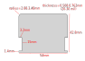

The flaps in this design are based around standard credit-card sized PVC cards (aka CR80). Each flap is 1/2 of a card, and has notches cut of the sides to create a "pin" that fits into the flap spool and allows it to flip freely.

There are either 52 flaps (v2) or 40 flaps (v0) for every module, so for a small 6-character display that will be a total of 312 flaps (v2) or 240 flaps (v0) that need to be cut and have letters applied to them if you take the full DIY approach.

Because there are so many flaps required for larger displays, I've also had custom flaps (both blank and pre-printed) manufactured that I sell in the [Bezek Labs Etsy store](https://bezeklabs.etsy.com/), which can save a lot of time and helps support continued development of this project.

# Option 1: Pre-printed flaps
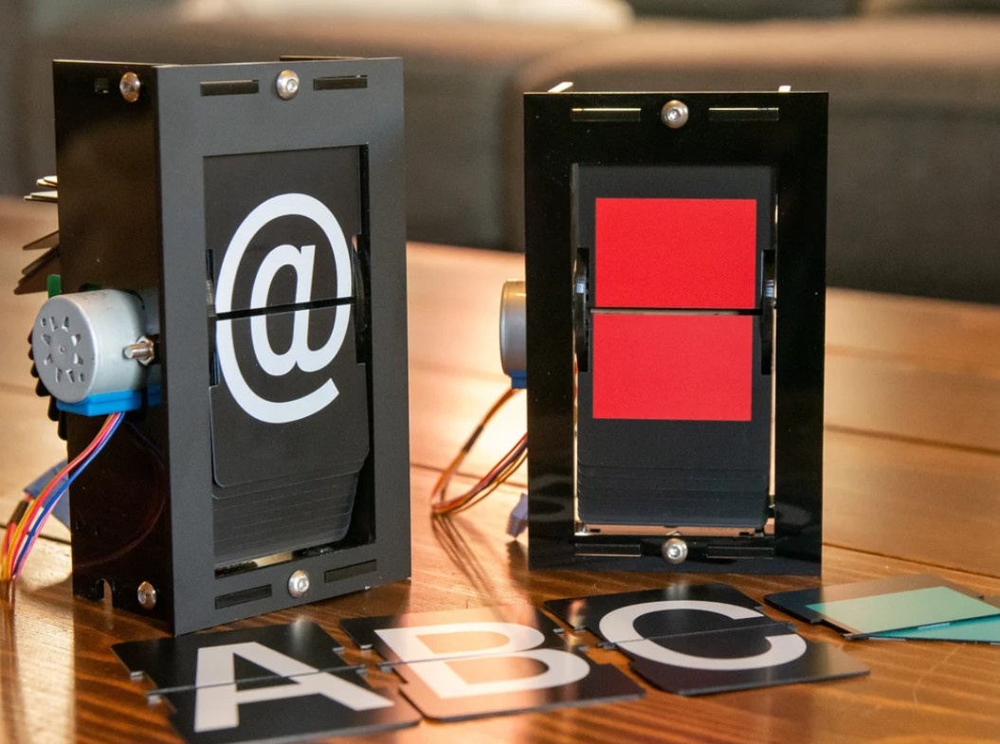

If you'd like to save the most time, I sell [packs of profesionally cut and printed flaps](https://www.etsy.com/listing/1685633114), ready to install into your split-flap display. THese are designed for v2 displays.

This is definitely the priciest option since they're completely custom for this project (a single pack requires 52 different printed designs!), but they look great and will hold up well to long-term use.

Available in <a href="https://www.etsy.com/listing/1685633114">1-packs, 6-packs, and 24-packs in the Bezek Labs Etsy store</a>.

<a href="https://www.etsy.com/listing/1685633114">
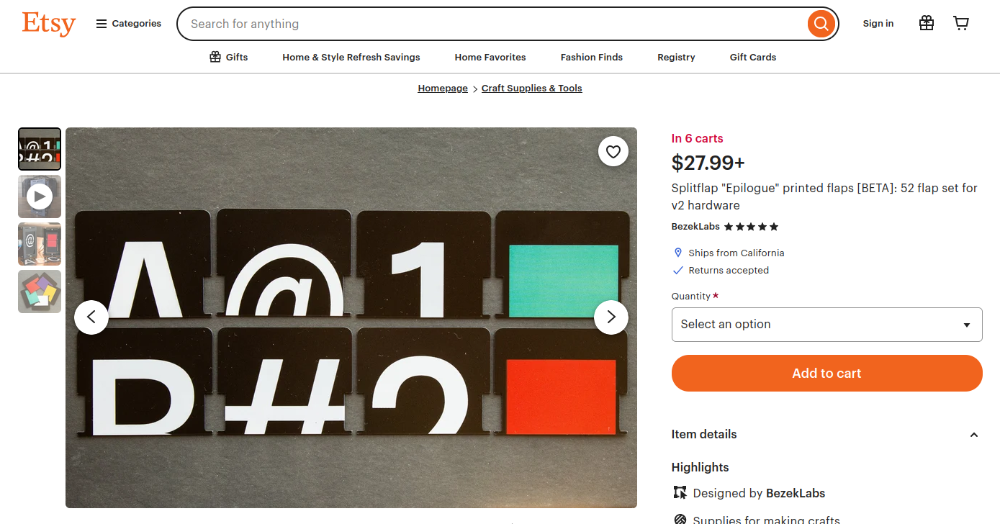
</a>

[^ Up to top](#about-flaps)

[<< Back to Documentation Index](../DocumentationIndex.md)

# Option 2: Pre-cut blank flaps
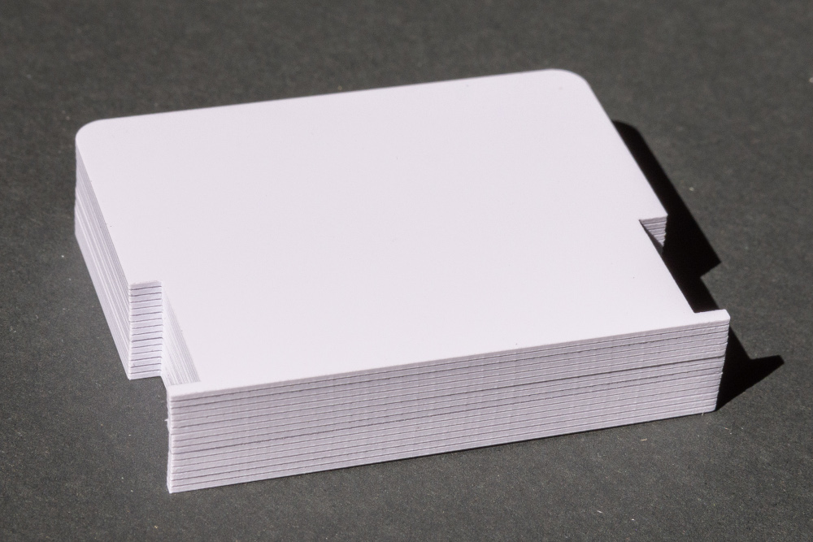
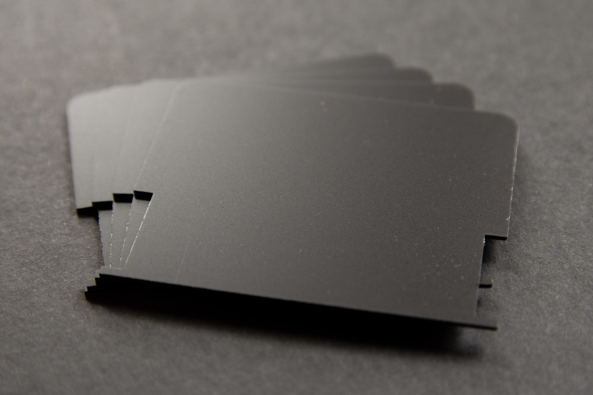

An intermediate option is to buy pre-cut blank flaps, and then apply letter stickers of your choice to them. This saves the hassle of cutting/punching every flap, but still involves some tedious work to apply stickers to every flap.

I sell packs of blank flaps in the <a href="https://bezeklabs.etsy.com/listing/979720975">Bezek Labs Etsy store</a>, available in glossy white or matte black.

<a href="https://bezeklabs.etsy.com/listing/979720975">
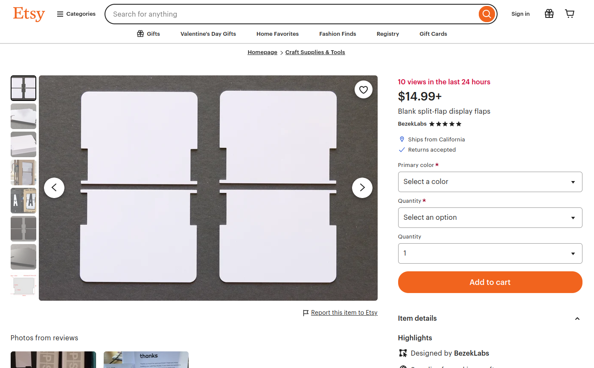
</a>

You'll need to [apply letter stickers](#33-apply-letter-stickers) to the blank flaps.

[^ Up to top](#about-flaps)

[<< Back to Documentation Index](../DocumentationIndex.md)

# Option 3: DIY flaps
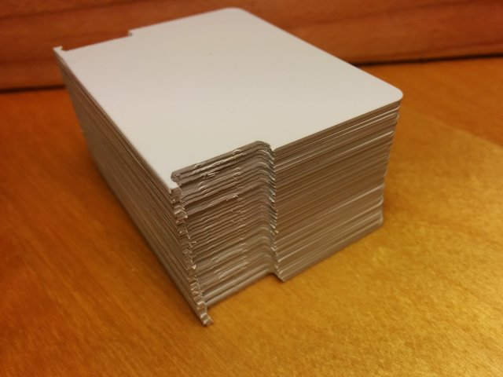

If you want the full DIY experience, the flaps can be created by first cutting a CR80 card in half, then punching notches out of each side of the half cards, and finally applying letter stickers to them.

If this sounds tedious, I'll admit that it is, but it's how I built the first few splitflap modules.

## 3.1 Build a flap cutting jig

The notch cut-outs need to be done consistently for all 40 flaps, so we'll first create a jig for the [badge slot punch](http://www.amazon.com/gp/product/B009YDRRB4) to hold a flap in a precise position while cutting it.

The jig can either be created by hand using a PVC card, or, if you have a 3d printer, can simply be printed ([see below](#3d-printing-a-jig))

### 3d printing a jig

If you have a 3d printer, you can print a jig model rather than creating the jig by hand. It will look like this:

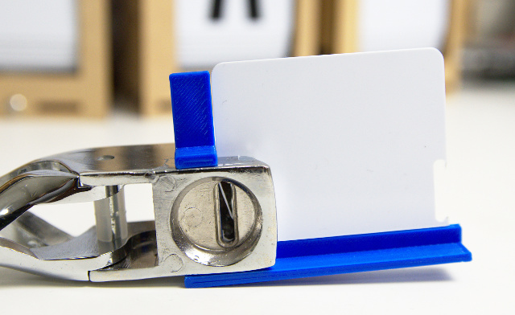

To print this jig, open [3d/punch_jig.scad](https://github.com/scottbez1/splitflap/blob/master/3d/tools/punch_jig.scad), render it and export to an STL file. You can use your slicer of choice to prepare the model for 3d printing.

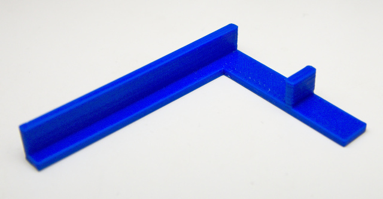 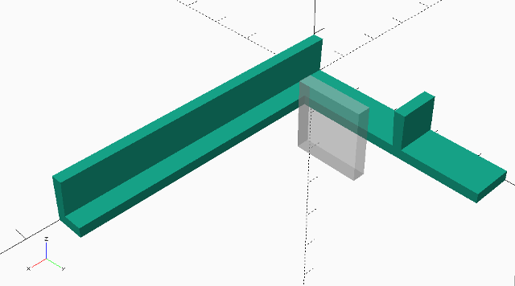

(Thanks to [@SilentM4X](https://twitter.com/SilentM4X) for the [idea to print the jig](https://twitter.com/SilentM4X/status/974688413373870085)!)

### Creating a jig by hand

The jig created from a PVC card will eventually look like this:

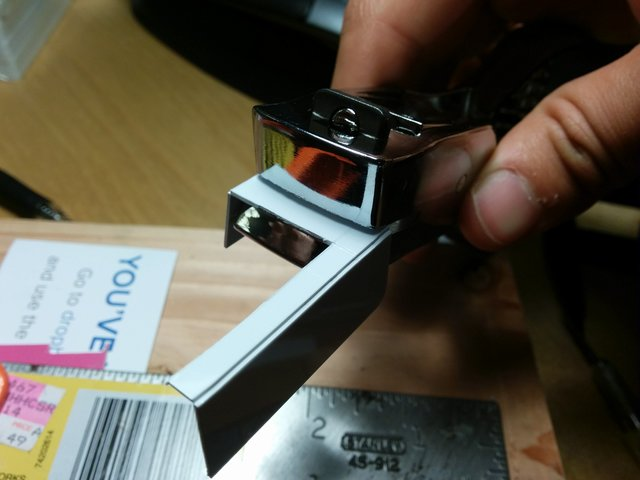

To build this, start by taking half a PVC card (or any spare ID or credit card you may have laying around), insert it all the way to the back of the punch, and punch a slot in the center. While the punch is still engaged (holding the card in place), take your X-Acto knife and lightly score the top of the card along the outer edges of the punch (just enough to mark it).

Take the card and a ruler and score it along the 2 lines you marked (cut about 1/3 of the way through the card thickness, but err on the side of cutting less). Then align the ruler with the flat edge of the punched slot nearest the card edge and use the knife to fully cut the card from the right side of the punched slot to the right edge of the card. Then turn the ruler 90 degrees and place it ~1-2mm outside the left side of the punched slot (this determines the thickness of the flap "pin") and cut from the bottom edge of the slot to the top of the card. 

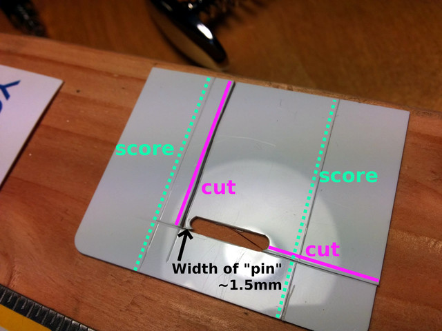

Connect those 2 cuts so that the upper right section of the card can be removed entirely:

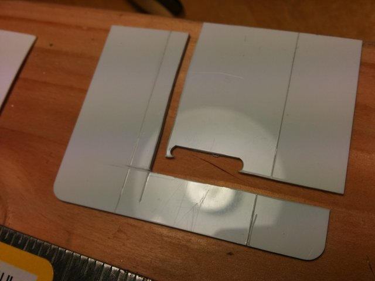

Fold the card 90 degrees away from you along the 2 scored edges:

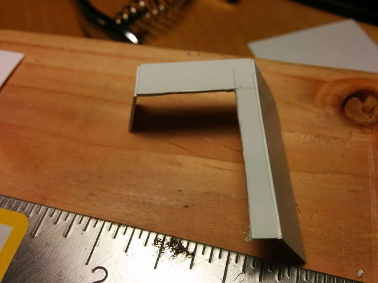

Insert the jig into the punch (the same orientation you originally punched it), and tape it into place:

 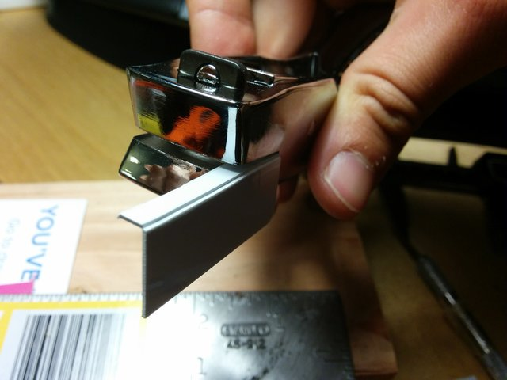

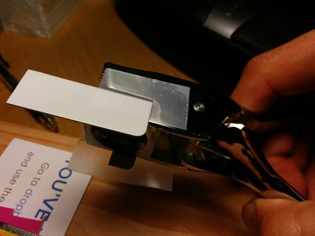 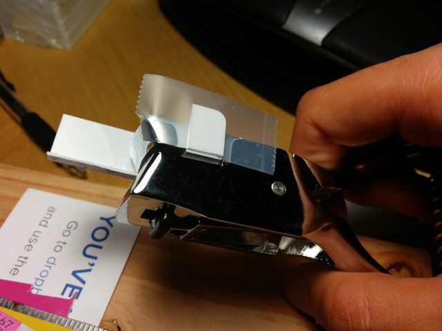

Your flap-cutting jig is complete!

[^ Up to top](#about-flaps)

[<< Back to Documentation Index](../DocumentationIndex.md)

## 3.2 Cut flaps

To cut the flaps from CR80 PVC cards, they first need to be cut in half. You could probably do this with a paper guillotine, but I don't own one so I made a jig to score them with a utility knife and then snap them in half.

Start by putting 3 nails into a scrap piece of wood to hold the card in place:

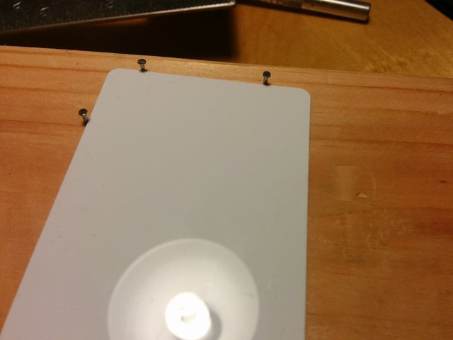

Then, on either side of the working area, place a card or two (I used a PVC card plus a business card) to elevate a ruler which will be clamped in place as a straight edge for scoring.

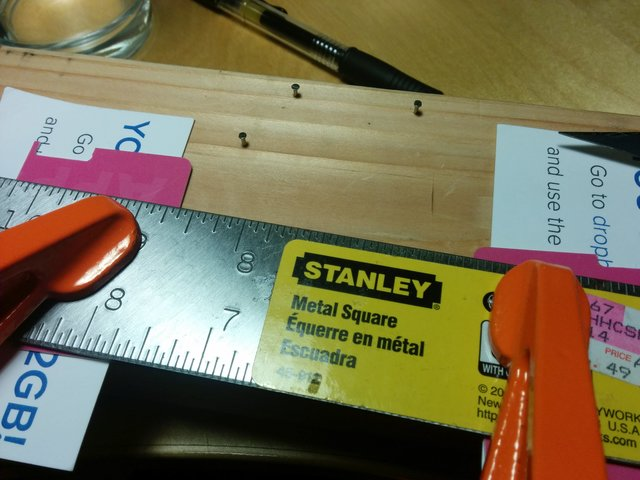

Make sure the ruler is clamped exactly 1/2 card length away from the two top nails:

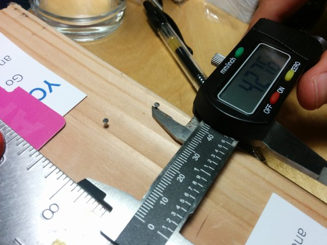

Then slide a blank card under the ruler and hold it tightly against the nails while scoring along the ruler edge.

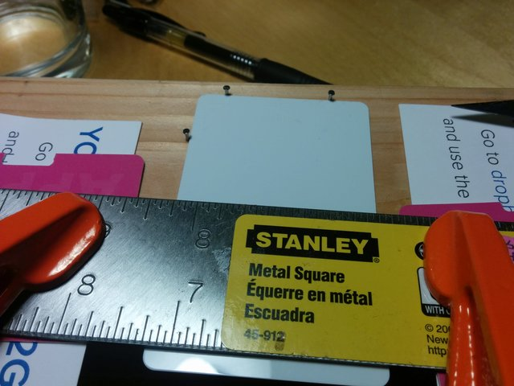

You should get a nice clean line, which doesn't have to be too deep. 

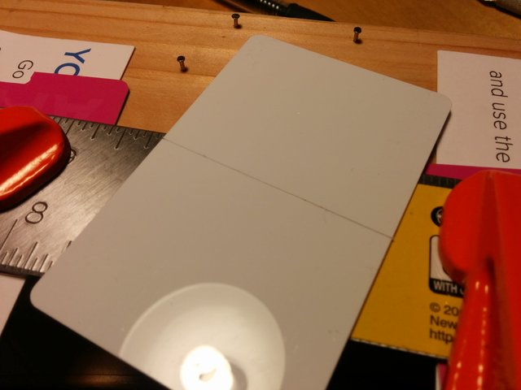

Bend the card away from the cut until it's folded back on itself, making sure that the ends of the card match up with each other (otherwise adjust the ruler alignment to correct for this). Then straighten the card and bend the opposite direction until it snaps in half.

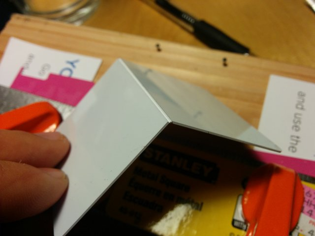
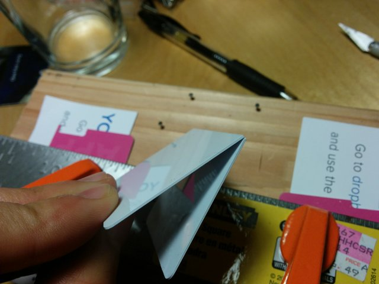

Do this with 20 cards to get 40 half-cards. Then take each half-card and use the [[flap cutting jig|Build flap cutting jig]] to punch a notch out of each side.

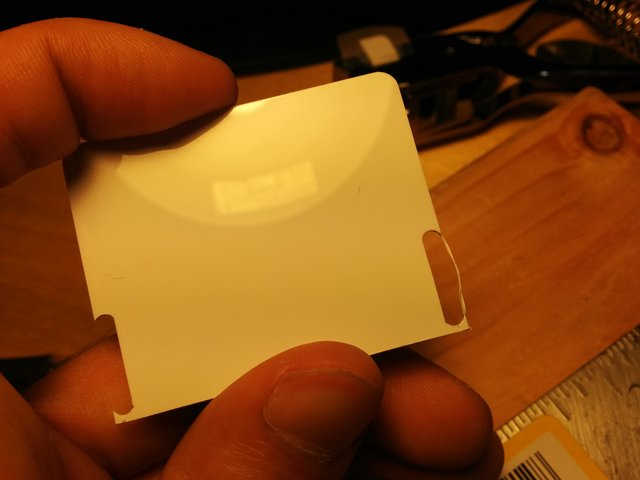
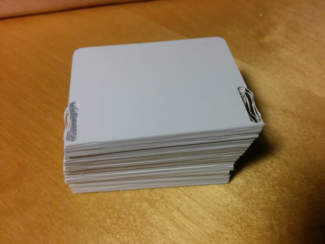

 The punched holes may not be completely clean (e.g. some material left outside the hole) but that's ok. Take some diagonal cutters to clip off the excess material and clean up the top/bottom of the punched notch.

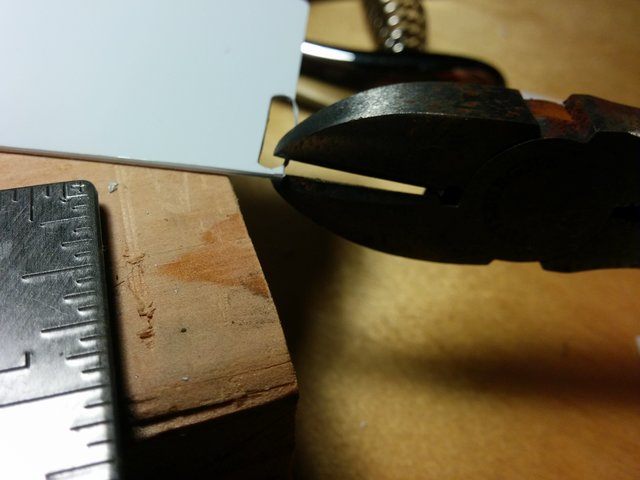 

If you're interested in more precise dimensions for the flaps and cutouts and the reasoning behind those values, see the discussion here: https://github.com/scottbez1/splitflap/issues/8

If you'd like to save yourself some time, an alternative to cutting your own flaps is to purchase pre-cut flaps that I've had professionally made, [available on Etsy](https://bezeklabs.etsy.com/listing/979720975). Purchasing pre-cut flaps from me will also help fund the continued development of this open-source project.

[^ Up to top](#about-flaps)

[<< Back to Documentation Index](../DocumentationIndex.md)

## 3.3 Apply letter stickers

For applying letter stickers to the flaps, I generally recommend purchasing store-bought vinyl letter sticker packs (see the [v2 complete ordering guide](/docs/v2/OrderingComplete.md) or [v0 complete ordering guide](/docs/v0/OrderingComplete.md) for details).

If you have a vinyl cutter like a Cricut or Silhouette, you can use the [generate_fonts.py](https://github.com/scottbez1/splitflap/blob/master/3d/scripts/generate_fonts.py) script to generate a custom flap letter stickers in the font/design of your choice. I recommend following [Dave Madison's excellent blog post](https://www.partsnotincluded.com/building-diy-split-flap-displays/#:~:text=Letter%20Generation) for tips on how to do this! (And kudos to Dave Madison for contributing that font generation script to the project!)

Applying the letter stickers to each of the 40 flaps is a painstaking, slow process. After a bit of practice, it still took me about 1.5 hours and a lot of patience to apply all the stickers to a new set of flaps:

[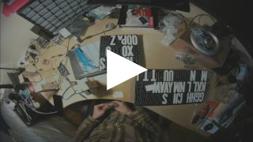](https://www.youtube.com/watch?v=N_ifOY9FLs8)

**Note:** I've since discovered a better way of applying letter stickers - see [New Instructions](#new-instructions). The [Old Instructions](#old-instructions) are still included below, but no longer recommended.

### New Instructions

Watch the [youtube video](https://www.youtube.com/watch?v=3lFECISLwyI):

This method is a lot less stressful and offers much better alignment than the older method.

1. Tape down old credit cards or hotel keycards so they form a U-shaped jig that cradles 2 flaps. Place 2 blank flaps into that jig. (Optionally tape another card or piece of paper that covers the bottom 3/16 inch (4.76mm) of the bottom flap -- this serves as a baseline for aligning the stickers)
1. Using food storage cling wrap applied tightly over a clear container, place the letter sticker **upside down** (sticky side UP) on the cling wrap. It should be attracted to the cling wrap because of static electricity, which will allow us to flip the whole thing over without the sticker falling off.
1. Flip the container+cling wrap+sticker over, and looking through the clear container and cling wrap, align the letter onto the 2 flaps (using the optional baseline alignment guide mentioned above, if you have it). Press the container down so the sticker adheres to the flaps and remove the container.
1. Using your finger, press down all over the letter sticker to ensure it's adhered and there are no air bubbles.
1. Cut the letter sticker in half along the gap between the 2 flaps.
1. Remove the bottom flap from the jig and set aside. Take the top flap and flip down so it's in the place of the bottom flap, and place a new blank flap in the top position.
1. Repeat steps 2-6 with the next letter sticker.

### Old Instructions

I've found it's easiest to keep the order correct by starting with all but two of the (empty) flaps already on the spool. You can add/remove flaps on the spool by gently squeezing the flap so the middle of the flap bows away from the spool's center: hold your index finger in a cup shape underneath the flap so only the flap's edges touch your finger, and then press your thumb into the center so the flap bends to follow the contour of your index finger. This will cause the pins to move inward enough to slide the flap into or out of place:

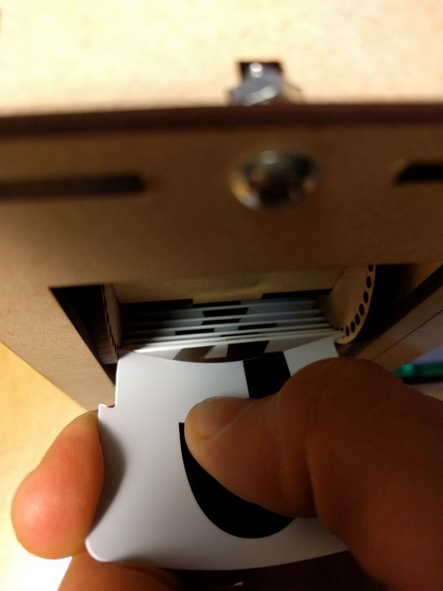

Start with just 2 empty flaps off the spool, flat on your workspace arranged as they would be on the spool (vertically mirroring each other, with the pins in the middle).

For each letter:

1. Use a hobby knife to cut the letter sticker in half. I used a spare PVC card cut to 1.5 inches tall as a guide since it's smaller and easier to move around than a ruler.
1. Peel up half the letter (you can use the knife's blade to help separate the sticker from the backing), and carefully apply it to one of the flaps, with the cut edge along the flap's cut edge.
1. Repeat with the other half of the letter, making sure to align it with the half you already placed.
1. Take the bottom flap and place it back on the spool, in the lower of the two available slots.
1. Take the top flap (still sitting on your workspace) and flip it vertically so it's face-down in the bottom-flap orientation.
1. From the spool, remove the empty flap above the empty slot (above ), and place it on your workspace in the top-flap orientation.
1. Repeat the steps for each letter. You will always be placing the bottom half of the next letter on the back of the flap that has the top half of the previous letter (e.g. the bottom half of "C" is on the back of the flap with the top half of "B", and the bottom half of "9" is on the same physical flap as the top half of "8").

[^ Up to top](#about-flaps)

[<< Back to Documentation Index](../DocumentationIndex.md)