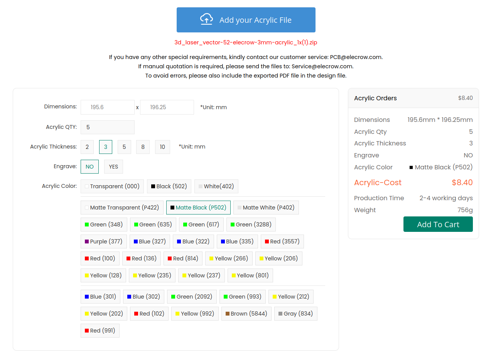

# Splitflap v2 Comprehensive Ordering Guide
[<< Back to Documentation Index](../DocumentationIndex.md)

The instructions below will walk you through ordering all the parts (excluding common tools) needed to build a splitflap v2 display with **6 modules** using the latest Chainlink electronics.

Ready to assemble? Jump ahead to the [Assembly Guide](Assembly.md) 

If you have any questions, please feel free to reach out to me (scott@bezeklabs.com). Or, join the [Discord server](https://discord.gg/wgehm3PcrC), to discuss or ask questions from the wider split-flap community!

😩 Feeling overwhelmed by this document? I don’t blame you, there’s a LOT here… So I put together a much shorter document that favors simplicity over comprehensiveness/lowest-cost,
for people in the US: [+Splitflap Ordering (the “easy” route)](OrderingEasy.md) 

1. [Order laser-cut parts](#order-laser-cut-parts)
3. [Order electronics](#order-electronics)
2. [Order hardware](#order-misc-hardware)

----------
# Order laser-cut parts

There are many places you can get laser-cut parts, but I’ve personally used Ponoko and Elecrow for ordering shipped to the US with an easy online-only process. I’ve previously recommended ordering from Ponoko - and while I still believe they have great quality and customer service so you'll get a great product, they’ve gotten too expensive to be my default recommendation any longer 😞 

For advanced makers: if you want to cut a single front panel that will be shared by an entire row (or grid) of modules, there is a script to do so with lots of configurable options like spacing, rows/cols, and even has a mode for generating geometry for CNC routing with necessary “dog-bones” applied to inside corners — see `generate_combined_front_panel.py`

💡 Note: v2 laser-cut parts are not dimensionally compatible with older v0 modules! If you’re extending an older display, make sure to use the older files (see the v0 [ordering instruction](../v0/OrderingComplete.md))

## Elecrow (recommended)

- Download the appropriate file:
  - 52-flap design
    - 3mm acrylic
      - Download [zip](https://s3.amazonaws.com/splitflap-artifacts/refs/tags/releases/mechanics/v2/3d/3d_laser_vector-52-elecrow-3mm-acrylic_1x.zip)
      - Go to [Elecrow acrylic laser cutting](https://www.elecrow.com/acrylic-cutting.html) and upload the zip file
      - Enter dimensions: 
      - Select thickness: 3mm
      - Engrave: No
      - Acrylic color: Matte Black (P502) is recommended
    - 3mm wood
      - Download [zip](https://s3.amazonaws.com/splitflap-artifacts/refs/tags/releases/mechanics/v2/3d/3d_laser_vector-52-elecrow-3mm-wood_1x.zip)
      - Go to [Elecrow wood laser cutting](https://www.elecrow.com/5pcs-wood-laser-cutting-service.html)
      - Dimension: 20cm Max * 20cm Max(Thickness: 3mm)
  - 40-flap design
    - 3mm acrylic
      - Download [zip](https://s3.amazonaws.com/splitflap-artifacts/refs/tags/releases/mechanics/v2/3d/3d_laser_vector-40-elecrow-3mm-acrylic_1x.zip)
      - Go to [Elecrow acrylic laser cutting](https://www.elecrow.com/acrylic-cutting.html) and upload the zip file
      - Enter dimensions: 
      - Select thickness: 3mm
      - Engrave: No
      - Acrylic color: Matte Black (P502) is recommended
    - 3mm wood
      - Download [zip](https://s3.amazonaws.com/splitflap-artifacts/refs/tags/releases/mechanics/v2/3d/3d_laser_vector-40-elecrow-3mm-wood_1x.zip)
      - Go to [Elecrow wood laser cutting](https://www.elecrow.com/5pcs-wood-laser-cutting-service.html)
      - Dimension: 20cm Max * 20cm Max(Thickness: 3mm)

## Ponoko (also recommended, but pricey)
- Download the appropriate file
    - 52-flap design
        - 3mm Acrylic: [svg](https://s3.amazonaws.com/splitflap-artifacts/refs/tags/releases/mechanics/v2/3d/3d_laser_vector-52-ponoko-3mm-acrylic_1x.svg) 
        - 3mm MDF: [svg](https://s3.amazonaws.com/splitflap-artifacts/refs/tags/releases/mechanics/v2/3d/3d_laser_vector-52-ponoko-3mm-mdf_1x.svg) 
    - 40-flap design
        - 3mm Acrylic: [svg](https://s3.amazonaws.com/splitflap-artifacts/refs/tags/releases/mechanics/v2/3d/3d_laser_vector-40-ponoko-3mm-acrylic_1x.svg) 
        - 3mm MDF: [svg](https://s3.amazonaws.com/splitflap-artifacts/refs/tags/releases/mechanics/v2/3d/3d_laser_vector-40-ponoko-3mm-mdf_1x.svg) 

- Go to [Ponoko](https://www.ponoko.com/) and sign up for an account.
- [Upload](https://www.ponoko.com/designs) the SVG file from above. Confirm the dimensions match the values above, and check that blue lines are set for “Cutting” and black fill is set for “Area Engraving” (or turn this off to skip engraved features)

- Select a material - [MDF](https://www.ponoko.com/materials/mdf-fiberboard) or [Acrylic](https://www.ponoko.com/materials/black-matte-acrylic) are recommended — choose 3.0mm (0.12 inches) thickness. Make sure to check the material’s maximum size against the dimensions provided next to the file links above; some materials may be too small to order the 4x versions.

💡 **Important note if ordering Matte 1-Side acrylic at Ponoko:** you ***must*** immediately send special instructions to Ponoko after placing your order, requesting to have the design engraved on the *glossy* side. This will result in the design being correctly cut so the matte surface will be on the exterior of the display when assembled. From Ponoko support (as of 2021-05-13): 

> The matte is [by default] cut with the matte side up (so engraving happens on this side as well).
> 
> If you would like to place an order and have us engrave on the glossy side, just **reply to the order confirmation page** with your request and we'll be sure to make note in the order details.

----------
# Order electronics

The Chainlink system is a newer electronics system based around the more powerful ESP32 microcontroller (which adds things like wifi support) and incorporates learnings from the earlier Classic Controller. New development is focused on the Chainlink system.

The basic pieces that you’ll need for a Chainlink system:

- **Chainlink Driver board** (1 for every 6 split-flap modules you want to control)
- **Chainlink Buddy** + **ESP32** (1 for the whole display, regardless of size)
- **Sensors** (1 for every split-flap module)

The easiest and best-supported approach is to purchase each of those items from the Bezek Labs Etsy store (US only) - I’ve set up the store so that items comes with the necessary accessories, meaning there are fewer things you need to track down and purchase separately from different suppliers. Proceeds also help fund continued development of the project!

💡 See the [Chainlink User Guide](../ElectronicsGuide.md) for more info about different configurations.

## Order Chainlink Driver

The Chainlink Driver is what drives up to 6 split-flap modules. Multiple Chainlink Drivers can be chained (hence the name!) to create much larger displays (I have created a 108-module display using 18 Chainlink Driver boards).

The Chainlink Driver uses mostly surface-mount components so it’s optimized for factory production moreso than hand-soldering (though you can of course do that if you’d like)

[**Recommended] Option 1: Purchase fully-tested PCBA on Etsy (US shipping only)**
I sell mostly-pre-assembled [Chainlink Driver boards in the Bezek Labs Etsy store](https://bezeklabs.etsy.com/listing/1123280069/splitflap-chainlink-driver-v11) (includes accessories: connectors, ribbon cable)

These have all the tricky surface-mount components already soldered for you. You’ll just need to solder the through-hole connectors, which are pretty easy.

Every single board that I sell goes through a rigorous 100% functionality test which validates every single motor output, sensor input, LED, and data line works as expected, using a custom test jig I developed.

This option also includes all the connectors and ribbon cable you’ll need, so you don’t need to order anything separately!

And, if you want to make sure you get the right 28byj-48 motors instead of just ordering on AliExpress and hoping for the best, I’ve added an option on Etsy to include 6x motors with your Chainlink Driver order! Yes, they’re more expensive than ordering on AliExpress directly, but they’ll ship quickly and you’ll know you’re getting good motors.

**Option 2: Purchase assembled Chainlink Driver from JLCPCB, and purchase connectors and ribbon cable separately**
The Chainlink Driver design is optimized for JLCPCB assembly, so it’s mostly a drag-and-drop process, but you’ll need to carefully understand the options you select. Most importantly, if JLCPCB is out of stock of a component, *they will continue to build your order and simply omit that component!* So be careful to check all warnings or notices that appear when ordering.

Note that JLCPCB assembly involves a number of fixed costs (such as $3 per unique part, and shipping fees) which make larger quantities a better value. 

Download the following 3 items from the latest Chainlink Driver release (v1.1):

- gerber files (for the PCB)
- BOM (specifies which components are needed for assembly)
- CPL (specifies placement locations for components)

To order:

- Go to JLCPCB https://cart.jlcpcb.com/quote
- Upload gerber zip
- Select your quantity, PCB color
- Confirm other parameters:
    - Dimensions: (accept auto-generated dimensions, which will likely be 30.48 x 198.12)
    - PCB Thickness: 1.6
    - Outer Copper Weight: 1oz

- Select SMT Assembly
    - Assemble top side
    - Select your quantity to assemble
    - Tooling holes: select **Added by Customer** (these are included in the design already, so you do not need JLC to add them)
    - Confirm

- Upload BOM File
- Upload CPL (csv) file

- Review parts
    - ⚠️ Make sure you check this step carefully, as any parts that are out of stock will simply be omitted! ⚠️ 
    - “No part selected” is *normal* for several connectors that will not be assembled by JLCPCB (see below) - these will be “J”-prefixed designators such as “Motor A”, “Sensor C”, or “Input” or “Output”

- Review parts placement
- Save to Cart
- Checkout (note that JLC does NOT reserve parts until you’ve checked out and paid your order, so if stock is low there is a chance parts will be missing if you wait to pay!)

If you wish to hand-assemble some of the through-hole connectors rather than having JLCPCB assemble them for you, you can unselect these components when placing your order, then order and assemble them yourself:

- 2x IDC shrouded connectors, 2x4, 2.54mm spacing, e.g. JLC/LCSC [C601937](https://lcsc.com/product-detail/IDC-Connectors_JILN-321008SG0ABK00A01_C601937.html), or on [Digi-Key](https://www.digikey.com/en/products/detail/adam-tech/BHR-08-VUA/9832409)
- 6x JST XH 5 pin connectors, e.g JLC/LCSC [C161872](https://lcsc.com/product-detail/Wire-To-Board-Wire-To-Wire-Connector_JST-Sales-America-B5B-XH-AM-LF-SN_C161872.html). or [C378947](https://lcsc.com/product-detail/Wire-To-Board-Wire-To-Wire-Connector_JST-Sales-America-B5B-XH-A-BK-LF-SN_C378947.html), or LCSC [C157991](https://lcsc.com/product-detail/Wire-To-Board-Wire-To-Wire-Connector_JST-Sales-America-B5B-XH-A-LF-SN_C157991.html), or on [Digi-Key](https://www.digikey.com/en/products/detail/jst-sales-america-inc/B5B-XH-AM-LF-SN/1651037)
- 6x 3-pin male headers, 2.54mm spacing, e.g. JLC/LCSC [C49257](http://), or on Digi-Key [3-pin](https://www.digikey.com/en/products/detail/sullins-connector-solutions/PREC003SAAN-RC/2774851) or purchase [40-pin](https://www.digikey.com/en/products/detail/sullins-connector-solutions/PREC040SAAN-RC/2774814) and break apart, (or readily available in bulk on Amazon, etc)

In order to connect your Chainlink Driver to your microcontroller (or to another Chainlink Driver in a chain), you’ll also need an IDC ribbon cable + connectors:

- 1x 8 conductor 1.27mm spacing ribbon cable (45cm recommended minimum length for chaining), [e.g. on Digi-Key](https://www.digikey.com/en/products/detail/w%C3%BCrth-elektronik/63910815521CAB/8324550)
- 2x IDC cable connectors, e.g. LCSC [C601910](https://lcsc.com/product-detail/IDC-Connectors_JILN-531408YBS0BW01_C601910.html), or on [Digi-Key](https://www.digikey.com/en/products/detail/adam-tech/FCS-08-SG/9832361)
- You could alternatively look for an assembled 8P IDC cable on e.g. Amazon, though make sure it's a straight-through cable (i.e. notches on the connectors both face the same way)

You may get an email from JLCPCB after placing your order, asking to double-check the orientation of the screw terminals. See images below for the correct orientation: the wires would go *over* the Power labels on the PCB to be inserted into the front of the screw terminals.

**Option 3: Purchase bare PCB, components, and hand-assemble**
This is an advanced option which will require hand-soldering surface mount components. While the components aren’t tiny (ICs are SOIC packages and passives are 0603), it will require some skill and patience.

You might also consider ordering a stencil and reflow soldering the components yourself. However, be aware that the PCB is long and thin so it is prone to warping when heated, so you may have difficulty if you plan to use a hot plate rather than an oven.

Follow the instructions from Option 2 above for ordering the PCBs, and instead of selecting assembly, you can use the BOM file to order all the components yourself. The BOM file uses LCSC part numbers.

## Order Chainlink Buddy and ESP32

You’ll connect your ESP32 microcontroller to the first Chainlink Driver in the chain. The best way to do this is with one of the available Chainlink “Buddy” boards, which allow you to plug in the IDC/ribbon cable directly. 

Many different ESP32 modules exist, and most of them should be compatible (as long as they are dual-core), but I strongly recommend the TTGO T-Display (on [Amazon](https://amzn.to/3kHwhMm) for quick shipping [affiliate links help support this project at no cost to you, or use a [non-affiliate link](https://www.amazon.com/LILYGO-T-Display-Arduino-Development-CH9102F/dp/B099MPFJ9M) if you’d prefer], or [AliExpress](http://) if you don’t mind waiting). It includes a 240x135 LCD that the splitflap firmware supports out of the box, which can be very useful for debugging.

**Chainlink Buddy [T-Display]**

The Chainlink Buddy [T-Display] is the recommended approach for most people, and makes it really easy to connect a TTGO T-Display microcontroller to your Chainlink system, with a ribbon cable connector, screw terminals for power, and a barrel jack for convenient 12v power input.

[Recommended] Available [in the Bezek Labs Etsy store (US only)](https://bezeklabs.etsy.com/listing/1109357786/splitflap-chainlink-buddy-t-display) (includes accessories: IDC connector, screw terminals, barrel jack, and female headers).
There’s also an option to include the T-Display ESP32 module as well if you want to make sure you get the right thing.

or, you can order the PCB yourself using the gerbers, and you will also need to order the following items to go with it:

- 1x IDC shrouded connectors, 2x4, 2.54mm spacing, e.g. LCSC [C601937](https://lcsc.com/product-detail/IDC-Connectors_JILN-321008SG0ABK00A01_C601937.html)
- 1x 3-pin 5.08mm spacing screw terminal, e.g. LCSC [C72334](https://lcsc.com/product-detail/Screw-terminal_Ningbo-Kangnex-Elec-WJ500V-5-08-3P_C72334.html)
- 1x 2.1mm barrel jack, e.g. LCSC [C381116](https://lcsc.com/product-detail/AC-DC-Power-Connectors_XKB-Connectivity-DC-005-5A-2-0_C381116.html)
- 2x 12-pin 2.54mm spacing female headers, e.g. LCSC [C350303](https://lcsc.com/product-detail/Female-Headers_HOAUC-2685Y-112CNG1SNA01_C350303.html)

**Chainlink Buddy [Breadboard] (alternative to the T-Display Buddy)**

If you’d like to use a different ESP32 module than the T-Display, the Breadboard Buddy is an alternative to the  simple way to cleanly connect the Chainlink ribbon cable to a breadboard for prototyping. This is not generally recommended, but is available for advanced users.

Available [in the Bezek Labs Etsy Store (US only)](https://bezeklabs.etsy.com/listing/1123863267/splitflap-chainlink-buddy-breadboard) (includes accessories: IDC connector, male pin headers)

or, you can order the PCB yourself using the gerbers and you will also need to order the following items to go with it:

- 1x IDC shrouded connectors, 2x4, 2.54mm spacing, e.g. LCSC [C601937](https://lcsc.com/product-detail/IDC-Connectors_JILN-321008SG0ABK00A01_C601937.html)
- 1x 5-pin 2.54mm spacing male pin headers

## Order Sensors

Each split-flap module will need a hall effect sensor to detect the home position. The best way to mount this is with a small sensor PCB.

[**Recommended] Option 1: Sensor kit v2 on Etsy (US only)**
To keep things simple, this kit includes 6 sets of all the parts you’ll need to assemble sensors:

- 6x Sensor PCB
- 6x 3-pin right angle headers
- 6x 4mm magnet (this will mount onto your spool)
- (optional) 6x sensor cables

https://bezeklabs.etsy.com/listing/1696745674

**Option 2: Order partially-assembled PCBs directly, and order other parts separately**
The v2 sensor design is optimized for JLCPCB assembly, so it’s mostly a drag-and-drop process, but you’ll need to carefully understand the options you select. Most importantly, if JLCPCB is out of stock of a component, *they will continue to build your order and simply omit that component!* So be careful to check all warnings or notices that appear when ordering.

Note that JLCPCB assembly involves a number of fixed costs (such as $3 per unique part, and shipping fees) which make larger quantities a better value.

The sensor PCBs are simple enough that you can easily hand-solder them, so I'd actually recommend Option 3 below (ordering bare PCBs and parts and assembling them yourself) unless you are building a larger display.

To order assembled sensor v2 PCBs, download the following 3 items from the latest v2 sensor release:

- [Panelized gerber files](https://s3.amazonaws.com/splitflap-artifacts/refs/tags/releases/sensor-smd/v2/electronics-v2/sensor_smd-panelized-jlc/gerbers.zip) (for the PCB)
- [Panelized BOM](https://s3.amazonaws.com/splitflap-artifacts/refs/tags/releases/sensor-smd/v2/electronics-v2/sensor_smd-panelized-jlc/bom.csv) (specifies which components are needed for assembly)
- [Panelized CPL](https://s3.amazonaws.com/splitflap-artifacts/refs/tags/releases/sensor-smd/v2/electronics-v2/sensor_smd-panelized-jlc/pos.csv) (specifies placement locations for components)

To order:

- Go to JLCPCB https://cart.jlcpcb.com/quote
- Upload gerber zip
  - Set parameters:
      - Layers: 2
      - Dimensions: (accept auto-generated dimensions)
      - PCB Qty: 5 (remember, the "panel" that you're ordering includes 6x sensors per panel, so the total sensors will be 6x the PCB Quantity you enter here! i.e. you will end up with 30 sensor PCBs with an order of 5 PCBs. You can have fewer than this quantity assembled)
      - Product Type: Industrial/Consumer electronics
  - PCB specifications
      - Different design: 1
      - Delivery format: Panel by Customer
      - Panel Format:
          - Column: 2
          - Row: 3
      - PCB Thickness: 0.8mm ⚠️ This is not the default PCB thickness - make sure to select 0.8mm!
      - PCB Color: green is cheapest considering the less-common 0.8mm thickness
      - LeadFree HASL
  - Other options - leave all of these as defaults 

- Select PCB Assembly
    - Note: JLCPCB gives you the choice to only assemble a portion of PCBs you've ordered. In this example, I've shown ordering 5 PCBs (the minimum quantity) and only having 2 of the 5 assembled (the minimum assembly quantity).
    - Assemble top side
    - PCBA Type: Economic
    - PCBA Qty: 2 (This is 2 of the 6x _panels_, for 12x total sensor PCBs. If this option doesn't appear, change PCBA type to Standard then back to Economic!)
    - Tooling holes: Added by JLCPCB
    - Confirm Parts Placement: No (select Yes if you'd like extra assurance and know how to review the production gerber files they provide)
    - Parts Selection: By Customer
    - Advanced Options: leave these all as defaults 

- Upload BOM File
- Upload CPL (csv) file
- Make sure to select File provided as: "Complete File, just proceed with my own files"
  

- Review parts
    - ⚠️ Make sure you check this step carefully, as any parts that are out of stock will simply be omitted! ⚠️
  

- Review parts placement
  

- Save to Cart
- Checkout (note that JLC does NOT reserve parts until you’ve checked out and paid your order, so if stock is low there is a chance parts will be missing if you wait to pay!)

You'll also need to purchase these items separately:
- 6x 4mm round magnet (e.g. [Digi-Key](https://www.digikey.com/en/products/detail/radial-magnets-inc/9027/5218822))
- 6x 3-pin right-angle pin headers (e.g. [Digi-Key](https://www.digikey.com/en/products/detail/sullins-connector-solutions/PREC003SBAN-M71RC/2774931))
- 6x 300mm 3-pin “servo” male-to-male cable (e.g. [Amazon](https://amzn.to/3FdxP8K) (10 pack) [or, [non-affiliate link](https://www.amazon.com/VIMVIP-10pcs-300mm-Extension-Futaba/dp/B00N8OX7VO)], or [AliExpress](https://www.aliexpress.com/item/32800106648.html) (10 pack))
https://bezeklabs.etsy.com/listing/966380990/splitflap-sensor-pcb-set-bare

**Option 3: Order bare PCBs directly, and order all parts separately**
Follow the instructions above to order the PCBs but skip the assembly portion.

In addition to the parts mentioned above (magnets, connectors, cables) you’ll also need to order the parts for the PCB itself:
- 6x hall effect sensors (e.g. HX6286, LCSC [C495736](https://www.lcsc.com/product-detail/Hall-Switches_HUAXIN-HX6286ESO_C495736.html?s_z=n_C495736))
- (optional) 6x 0603 red LED (e.g. LCSC [C2286](https://www.lcsc.com/product-detail/LED-Indication-Discrete_Hubei-KENTO-Elec-KT-0603R_C2286.html?s_z=n_C2286))
- (optional for LEDs) 6x 0603 1k resistor (e.g. LCSC [C21190](https://www.lcsc.com/product-detail/Chip-Resistor-Surface-Mount_UNI-ROYAL-Uniroyal-Elec-0603WAF1001T5E_C21190.html?s_z=n_C21190))

# Order misc hardware

**Note:** AliExpress listings have a tendency to change or disappear, or you may end up getting a different or inferior product even if you use the same product listing that has worked before (ask me how I know 🙁). These are *suggestions only* - they worked at one point but there is **no guarantee** you will get the same quality product when ordering again! Also, if you've never ordered from AliExpress before, keep in mind that most items will take 2-4 weeks to arrive; you can often find similar parts for a higher price on Amazon or ebay if you'd prefer faster shipping.

Amazon links are affiliate links, which help support the project at no cost to you, but if you’d prefer to avoid using affiliate links, I’ve included non-affiliate direct links as well. All items are selected completely independently of the affiliate program, and I do not accept sponsorships or payments to recommend certain products.

| Item                                                                        | Qty needed to build 6 modules | Link                                                                                                                                                                                                                                                                                                                                                                                                                                                                                                                                                                                                                                                                                                | Available from BezekLabs (US only)                 | Notes                                                                                                                                                                                                                                                                                                                                                                                                                                                                                                                                                                                                                                                                                                                                                                                                                  |
| --------------------------------------------------------------------------- | ----------------------------- | --------------------------------------------------------------------------------------------------------------------------------------------------------------------------------------------------------------------------------------------------------------------------------------------------------------------------------------------------------------------------------------------------------------------------------------------------------------------------------------------------------------------------------------------------------------------------------------------------------------------------------------------------------------------------------------------------- | -------------------------------------------------- | ---------------------------------------------------------------------------------------------------------------------------------------------------------------------------------------------------------------------------------------------------------------------------------------------------------------------------------------------------------------------------------------------------------------------------------------------------------------------------------------------------------------------------------------------------------------------------------------------------------------------------------------------------------------------------------------------------------------------------------------------------------------------------------------------------------------------- |
| 12V 28BYJ-48 Stepper Motor                                                  | 6                             | See [+28BYJ-48 Motor Buying Guide](../MotorGuide.md)                                                                                                                                                                                                                                                                                                                                                                                                                                                                                                                                                                                 | Yes (optional addition to Chainlink Driver orders) | There are unfortunately a lot of different motors sold under the same name, and it can be hard to find the right ones. See the [Motor Buying Guide](../MotorGuide.md) for more details.                                                                                                                                                                                                                                                                                                                                                                                                                                                                                                                                           |
| M4 x 10mm **ISO 7380** bolt                                                 | 60                            | TODO | No                                                 |    Make sure to get **ISO 7380** (button head) bolts - other bolt head shapes may be too large for the design (see low clearance in photo to the right).  Must be **10mm length**.   ----------  Fastenal has brick-and-mortar locations in the US if you’d rather pick up locally.  If using black oxide for aesthetic reasons, note that they tend to be oily/dirtier to work with and will not have the same corrosion resistance as stainless. |
| M4 nut (hexagonal)                                                          | 60                            | TODO | No                                                 | 10 nuts needed per module  ----------  Fastenal has brick-and-mortar locations in the US if you’d rather pick up locally.  If using black oxide for aesthetic reasons, note that they tend to be oily/dirtier to work with and will not have the same corrosion resistance as stainless.                                                                                                                                                                                                                                                                     |
| Flap                                                                        | 312 (for 6x 52-flap modules)   or 240 (for 6x 40-flap modules)                         | Blank flaps: [Etsy](https://bezeklabs.etsy.com/listing/979720975/blank-splitflap-display-flaps) (6 pack for 6 modules = 312 flaps)  Pre-printed flaps: [Etsy](https://bezeklabs.etsy.com/listing/1685633114) (6 pack for 6 modules)   or purchase [PVC ID cards](https://www.amazon.com/CR80-Mil-Graphic-Quality-Cards/dp/B0045TD22A) and a [Badge Slot Punch](https://www.amazon.com/Badge-Punch-Puncher-Luggage-Credentials/dp/B0006M648E) then [build a cutting jig](../Flaps.md#31-build-a-flap-cutting-jig), and [create flaps yourself](../Flaps.md#32-cut-flaps)                            | 👈 Yes                                             | I may be a bit biased, but I *highly* recommend purchasing the die-cut flaps on Etsy if you’re in the US - it’s much easier and they’re much higher quality than cutting them yourself, though they do cost more than doing it yourself.  If you’re in the US, message me on Etsy and I’ll send you a couple free samples.                                                     |
| Letter Sticker Pack (If using **blank flaps** or cutting flaps yourself) | 3                             | [Amazon](https://amzn.to/3cvqfKB) [or, [non-affiliate](https://www.amazon.com/Duro-Decal-Permanent-Adhesive-Letters/dp/B0027601CM?) [link](https://www.amazon.com/Duro-Decal-Permanent-Adhesive-Letters/dp/B0027601CM)]                                                                                                                                                                                                                                                                                                                                                                                                                                                                           |                                                    | Each pack contains 2 of every letter (and a bunch of spares of more common letters, which isn’t helpful for us here)                                                                                                                                                                                                                                                                                                                                                                                                                                                                                                                                                                                                                                                                                                   |
| 12V Power Supply                                                            | 1                             | Many options on Amazon                                                                                                                                                                                                                                                                                                                                                                                                                                                                                                                                                                                                                                                                              |                                                    | Each module requires about 0.25A, so **for a 6 module kit you should get a supply rated for at least 1.5A**. This will depend on the specific 28byj-48 motors you get; not all of them have the same resistance, and therefore may have different current requirements.  “CCTV” or "12V LED" are good search terms for 12V supplies with the 2.1mm barrel jack connector                                                                                                                                                                                                                                                                                                                                                                                                                                                      |

----------
# Assemble

Ready to assemble your display? See the [complete assembly instructions document](Assembly.md).
